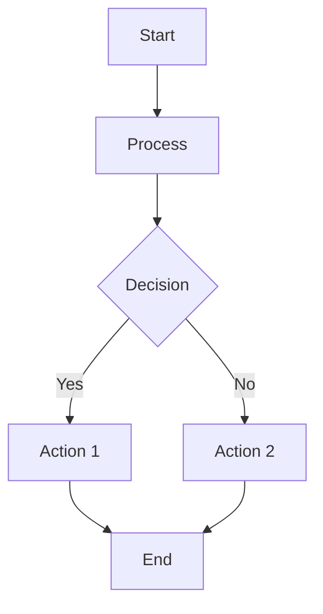

# 📋 Dokumentasi Activity Diagrams - Sistem Admin Tamu Perumahan

## 📖 Overview

Dokumentasi ini berisi activity diagrams lengkap untuk sistem admin tamu perumahan, mencakup fitur yang sudah ada dan rencana pengembangan masa depan. Activity diagrams ini menggambarkan alur proses bisnis secara detail untuk membantu dalam pengembangan dan maintenance sistem.

## 📁 Struktur Dokumentasi

```
docs/
├── README.md                           # Dokumentasi utama (file ini)
├── activity-diagrams.md               # Activity diagrams dalam format Markdown
├── future-activity-diagrams.md        # Activity diagrams fitur masa depan
├── activity-diagrams.html             # Visualisasi interaktif fitur saat ini
└── future-features-diagrams.html      # Visualisasi interaktif fitur masa depan
```

## 🎯 Fitur Saat Ini

### ✅ **Fitur yang Sudah Diimplementasi**

| No | Fitur | Status | Activity Diagram |
|----|-------|--------|------------------|
| 1 | Login Satpam | ✅ Selesai | [Lihat Diagram](#login-satpam) |
| 2 | Tambah Tamu Baru | ✅ Selesai | [Lihat Diagram](#tambah-tamu) |
| 3 | Logout Tamu | ✅ Selesai | [Lihat Diagram](#logout-tamu) |
| 4 | Export Data Tamu | ✅ Selesai | [Lihat Diagram](#export-data) |
| 5 | Dashboard Monitoring | ✅ Selesai | [Lihat Diagram](#dashboard) |
| 6 | Admin Panel (Filament) | ✅ Selesai | [Lihat Diagram](#admin-panel) |
| 7 | Search & Filter | ✅ Selesai | [Lihat Diagram](#search-filter) |
| 8 | Edit Data Tamu | ✅ Selesai | [Lihat Diagram](#edit-tamu) |

## 🚀 Fitur Masa Depan

### 🎯 **Roadmap Pengembangan**

#### 🔴 **HIGH PRIORITY** (Implementasi Segera)
| No | Fitur | Prioritas | Estimasi | Activity Diagram |
|----|-------|-----------|----------|------------------|
| 1 | Manajemen Warga | 🔴 HIGH | 2-3 minggu | [Lihat Diagram](#registrasi-warga) |
| 2 | Sistem Persetujuan Tamu | 🔴 HIGH | 2-3 minggu | [Lihat Diagram](#persetujuan-tamu) |
| 3 | Verifikasi QR Code | 🔴 HIGH | 1-2 minggu | [Lihat Diagram](#qr-verification) |
| 4 | Notifikasi Real-time | 🔴 HIGH | 2-3 minggu | [Lihat Diagram](#realtime-notif) |

#### 🟡 **MEDIUM PRIORITY** (Implementasi Tahap 2)
| No | Fitur | Prioritas | Estimasi | Activity Diagram |
|----|-------|-----------|----------|------------------|
| 5 | Booking Fasilitas | 🟡 MEDIUM | 3-4 minggu | [Lihat Diagram](#booking-fasilitas) |
| 6 | Manajemen Komplain | 🟡 MEDIUM | 2-3 minggu | [Lihat Diagram](#komplain) |
| 7 | Emergency Alert | 🟡 MEDIUM | 2-3 minggu | [Lihat Diagram](#emergency-alert) |
| 8 | Analytics & Reporting | 🟡 MEDIUM | 2-3 minggu | [Lihat Diagram](#analytics) |

#### 🟢 **LOW PRIORITY** (Implementasi Tahap 3)
| No | Fitur | Prioritas | Estimasi | Activity Diagram |
|----|-------|-----------|----------|------------------|
| 9 | Mobile App Sync | 🟢 LOW | 4-6 minggu | [Lihat Diagram](#mobile-sync) |
| 10 | Data Backup & Restore | 🟢 LOW | 1-2 minggu | [Lihat Diagram](#backup) |

## 📊 Cara Menggunakan Dokumentasi

### 1. **Melihat Activity Diagrams**

#### **Format HTML (Direkomendasikan)**
```bash
# Buka di browser untuk visualisasi interaktif
file:///path/to/admin_tamu/docs/activity-diagrams.html
file:///path/to/admin_tamu/docs/future-features-diagrams.html
```

#### **Format Markdown**
```bash
# Untuk development dan dokumentasi
docs/activity-diagrams.md
docs/future-activity-diagrams.md
```

### 2. **Menggunakan Mermaid.js**

Activity diagrams menggunakan syntax Mermaid.js yang dapat diintegrasikan dengan:
- GitHub/GitLab (native support)
- VS Code (dengan extension)
- Notion, Confluence
- Documentation tools lainnya

### 3. **Contoh Implementasi**



## 🛠️ Technical Requirements

### **Untuk Fitur HIGH PRIORITY**

#### **1. Manajemen Warga**
```php
// Database Schema
CREATE TABLE warga (
    id BIGINT PRIMARY KEY,
    nama VARCHAR(255),
    nomor_rumah VARCHAR(50),
    blok VARCHAR(10),
    telepon VARCHAR(20),
    email VARCHAR(255),
    foto_ktp TEXT,
    status ENUM('aktif', 'tidak_aktif'),
    created_at TIMESTAMP,
    updated_at TIMESTAMP
);
```

#### **2. Sistem Persetujuan Tamu**
```php
// Database Schema
CREATE TABLE persetujuan_tamu (
    id BIGINT PRIMARY KEY,
    warga_id BIGINT,
    nama_tamu VARCHAR(255),
    telepon_tamu VARCHAR(20),
    tanggal_kunjungan DATE,
    jam_kunjungan TIME,
    keperluan TEXT,
    status ENUM('pending', 'disetujui', 'ditolak'),
    qr_code TEXT,
    created_at TIMESTAMP,
    updated_at TIMESTAMP
);
```

#### **3. Package Dependencies**
```json
{
    "pusher/pusher-php-server": "^7.2",
    "endroid/qr-code": "^4.0",
    "intervention/image": "^2.7",
    "spatie/laravel-activitylog": "^4.0"
}
```

## 📋 Checklist Implementasi

### **Phase 1: Core Features (HIGH PRIORITY)**
- [ ] Setup database schema untuk warga
- [ ] Implementasi CRUD warga
- [ ] Sistem persetujuan tamu
- [ ] QR Code generation & verification
- [ ] Real-time notifications setup
- [ ] Testing & debugging

### **Phase 2: Extended Features (MEDIUM PRIORITY)**
- [ ] Booking system untuk fasilitas
- [ ] Complaint management system
- [ ] Emergency alert system
- [ ] Advanced analytics
- [ ] Testing & optimization

### **Phase 3: Advanced Features (LOW PRIORITY)**
- [ ] Mobile app development
- [ ] Backup & restore system
- [ ] Advanced security features
- [ ] Integration capabilities

## 🔧 Development Guidelines

### **1. Coding Standards**
- Follow PSR-12 coding standards
- Use Laravel best practices
- Implement proper error handling
- Add comprehensive logging

### **2. Database Design**
- Use proper foreign key constraints
- Implement soft deletes where needed
- Add proper indexes for performance
- Use migrations for schema changes

### **3. Security Considerations**
- Implement proper authentication
- Use CSRF protection
- Validate all inputs
- Implement rate limiting

### **4. Testing Strategy**
- Unit tests for models
- Feature tests for controllers
- Browser tests for critical flows
- API tests for endpoints

## 📞 Support & Maintenance

### **Documentation Updates**
- Update activity diagrams saat ada perubahan fitur
- Maintain changelog untuk setiap release
- Document API endpoints
- Keep user manual up to date

### **Performance Monitoring**
- Monitor database queries
- Track response times
- Monitor memory usage
- Set up error tracking

## 🎯 Success Metrics

### **Key Performance Indicators (KPIs)**
- User adoption rate
- System uptime (target: 99.9%)
- Response time (target: <2s)
- Error rate (target: <1%)
- User satisfaction score

### **Business Metrics**
- Reduction in manual processes
- Improved security compliance
- Enhanced user experience
- Operational efficiency gains

---

## 📝 Changelog

### **Version 1.0.0** (Current)
- ✅ Basic guest management
- ✅ Security guard interface
- ✅ Admin panel with Filament
- ✅ Export functionality
- ✅ Activity logging

### **Version 2.0.0** (Planned)
- 🔄 Resident management
- 🔄 Guest pre-approval system
- 🔄 QR code verification
- 🔄 Real-time notifications

### **Version 3.0.0** (Future)
- 🔄 Facility booking
- 🔄 Complaint management
- 🔄 Emergency alerts
- 🔄 Advanced analytics

---

**📧 Contact:** Untuk pertanyaan atau saran mengenai dokumentasi ini, silakan hubungi tim development.

**🔗 Links:**
- [Activity Diagrams (Interactive)](activity-diagrams.html)
- [Future Features (Interactive)](future-features-diagrams.html)
- [Project Repository](../README.md)