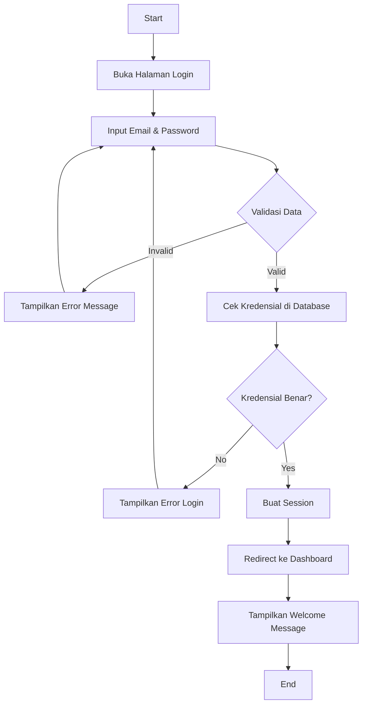
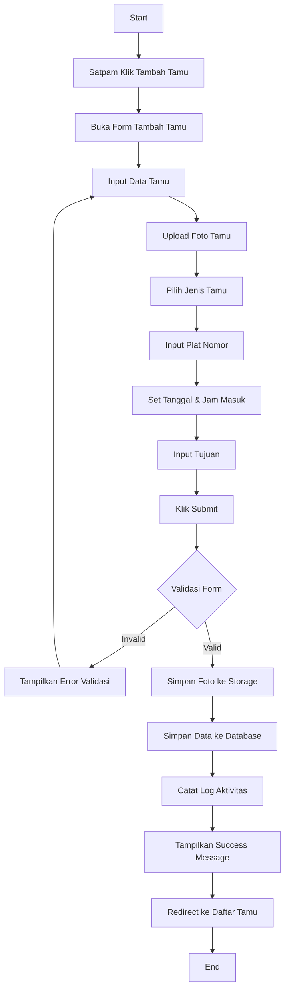
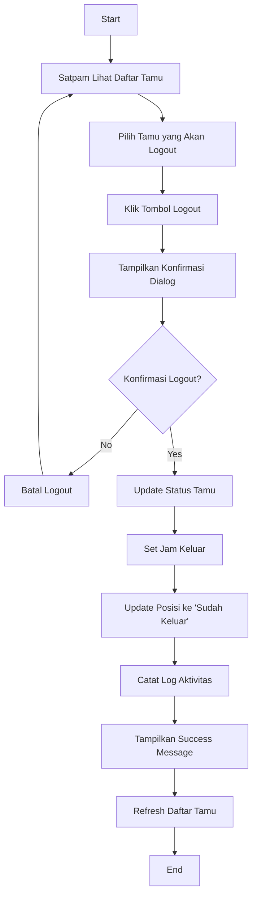
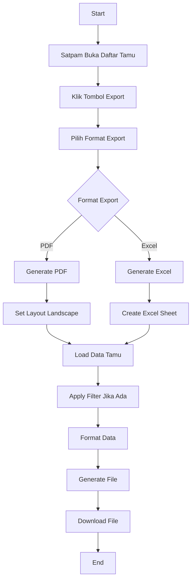
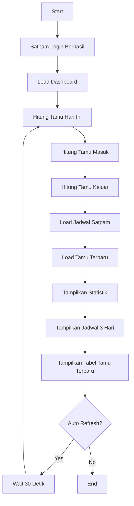
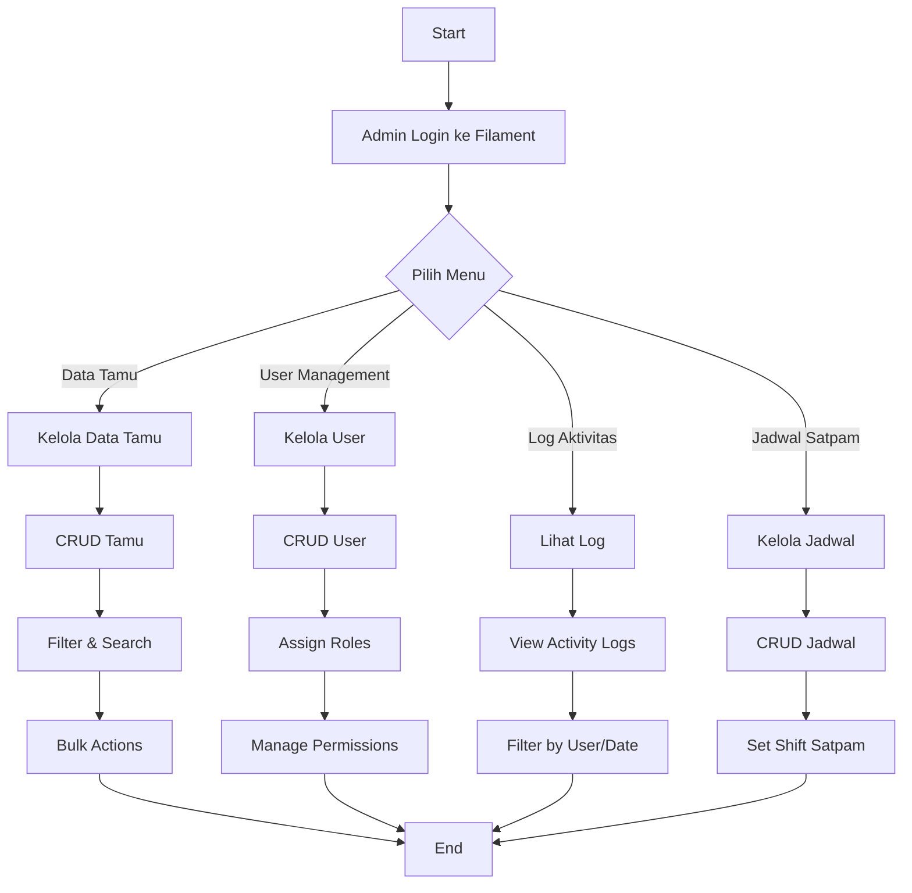
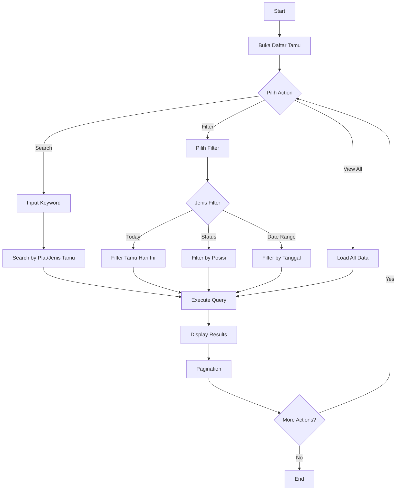
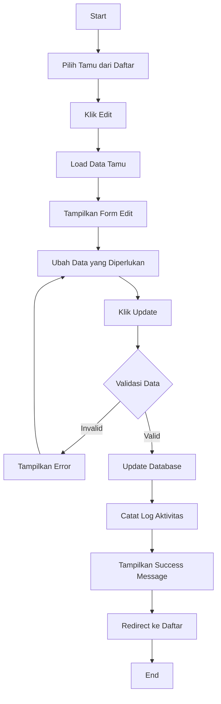
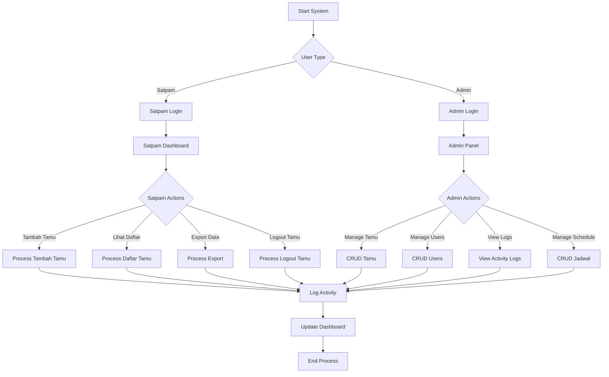
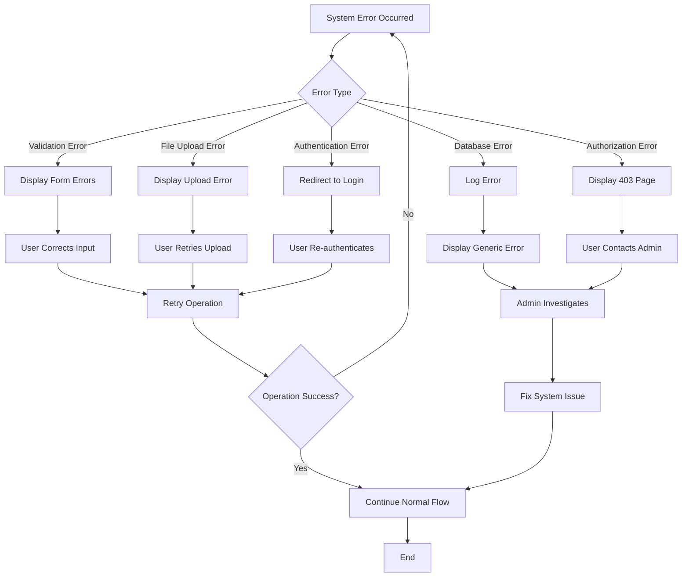

# Activity Diagrams - Sistem Admin Tamu Perumahan

## 1. Activity Diagram - Login Satpam

## 2. Activity Diagram - Tambah Tamu Baru

## 3. Activity Diagram - Logout Tamu

## 4. Activity Diagram - Export Data Tamu

## 5. Activity Diagram - Dashboard Monitoring

## 6. Activity Diagram - Admin Panel (Filament)

## 7. Activity Diagram - Search & Filter Tamu

## 8. Activity Diagram - Edit Data Tamu

## 9. Activity Diagram - Sistem Keseluruhan

## 10. Activity Diagram - Error Handling

