# 📋 Class Diagram - Sistem Admin Tamu Perumahan

## 📖 Overview

Class Diagram ini menggambarkan struktur kelas dan hubungan antar kelas dalam sistem admin tamu perumahan. Diagram ini mencakup semua model, controller, dan service yang digunakan dalam aplikasi.

## 🎯 Class Diagram - Model Classes

### 1. 👤 User Model

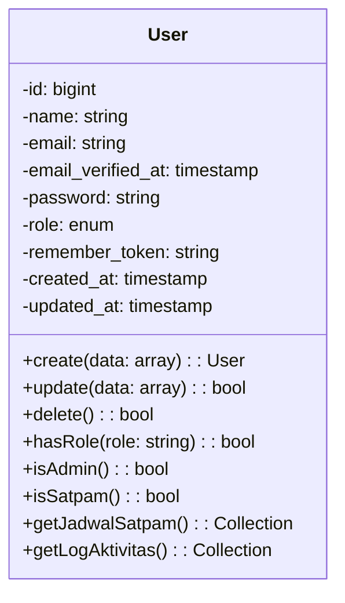
```mermaid
classDiagram
    class User {
        -id: bigint
        -name: string
        -email: string
        -email_verified_at: timestamp
        -password: string
        -role: enum
        -remember_token: string
        -created_at: timestamp
        -updated_at: timestamp
        
        +create(data: array): User
        +update(data: array): bool
        +delete(): bool
        +hasRole(role: string): bool
        +isAdmin(): bool
        +isSatpam(): bool
        +getJadwalSatpam(): Collection
        +getLogAktivitas(): Collection
    }
```

### 2. 👥 Tamu Model

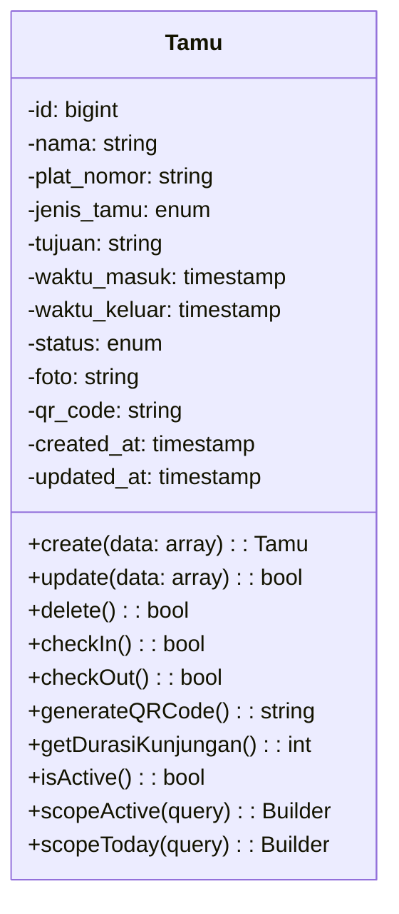
```mermaid
classDiagram
    class Tamu {
        -id: bigint
        -nama: string
        -plat_nomor: string
        -jenis_tamu: enum
        -tujuan: string
        -waktu_masuk: timestamp
        -waktu_keluar: timestamp
        -status: enum
        -foto: string
        -qr_code: string
        -created_at: timestamp
        -updated_at: timestamp
        
        +create(data: array): Tamu
        +update(data: array): bool
        +delete(): bool
        +checkIn(): bool
        +checkOut(): bool
        +generateQRCode(): string
        +getDurasiKunjungan(): int
        +isActive(): bool
        +scopeActive(query): Builder
        +scopeToday(query): Builder
    }
```

### 3. 📅 JadwalSatpam Model

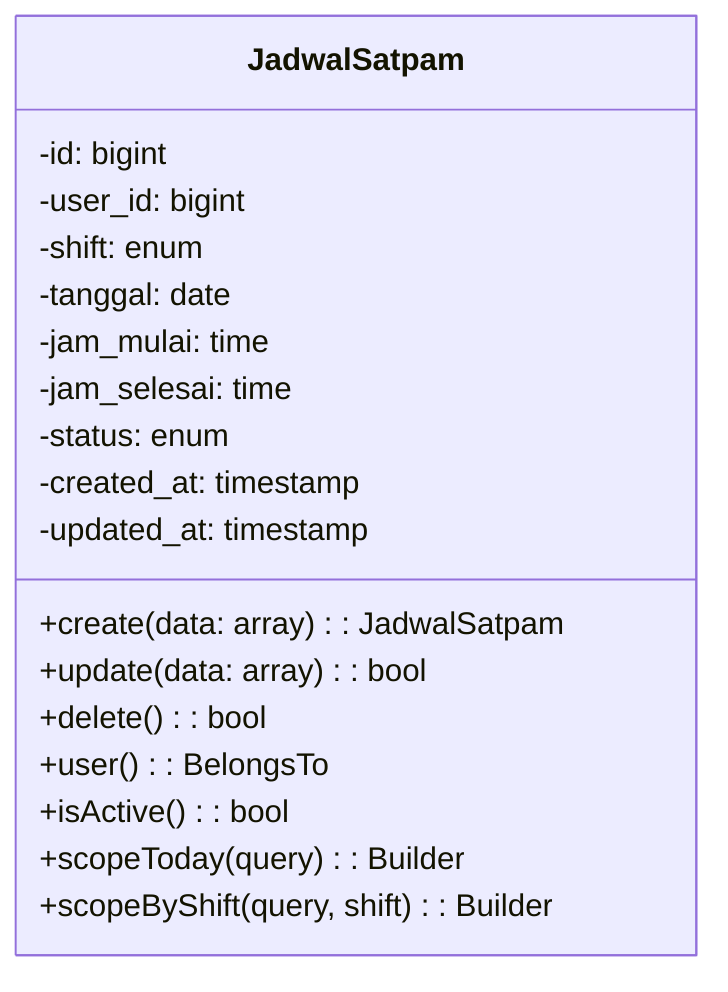
```mermaid
classDiagram
    class JadwalSatpam {
        -id: bigint
        -user_id: bigint
        -shift: enum
        -tanggal: date
        -jam_mulai: time
        -jam_selesai: time
        -status: enum
        -created_at: timestamp
        -updated_at: timestamp
        
        +create(data: array): JadwalSatpam
        +update(data: array): bool
        +delete(): bool
        +user(): BelongsTo
        +isActive(): bool
        +scopeToday(query): Builder
        +scopeByShift(query, shift): Builder
    }
```

### 4. 🏠 Warga Model (Future)

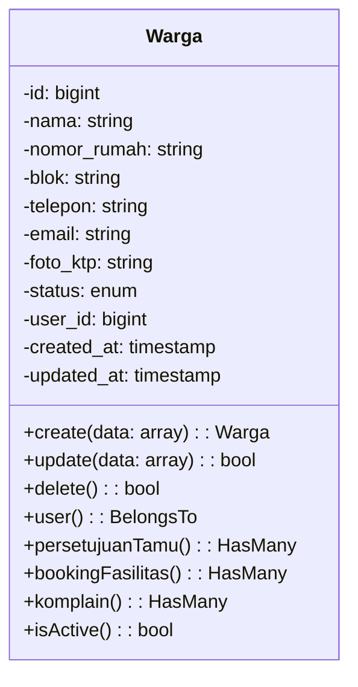
```mermaid
classDiagram
    class Warga {
        -id: bigint
        -nama: string
        -nomor_rumah: string
        -blok: string
        -telepon: string
        -email: string
        -foto_ktp: string
        -status: enum
        -user_id: bigint
        -created_at: timestamp
        -updated_at: timestamp
        
        +create(data: array): Warga
        +update(data: array): bool
        +delete(): bool
        +user(): BelongsTo
        +persetujuanTamu(): HasMany
        +bookingFasilitas(): HasMany
        +komplain(): HasMany
        +isActive(): bool
    }
```

### 5. ✅ PersetujuanTamu Model (Future)

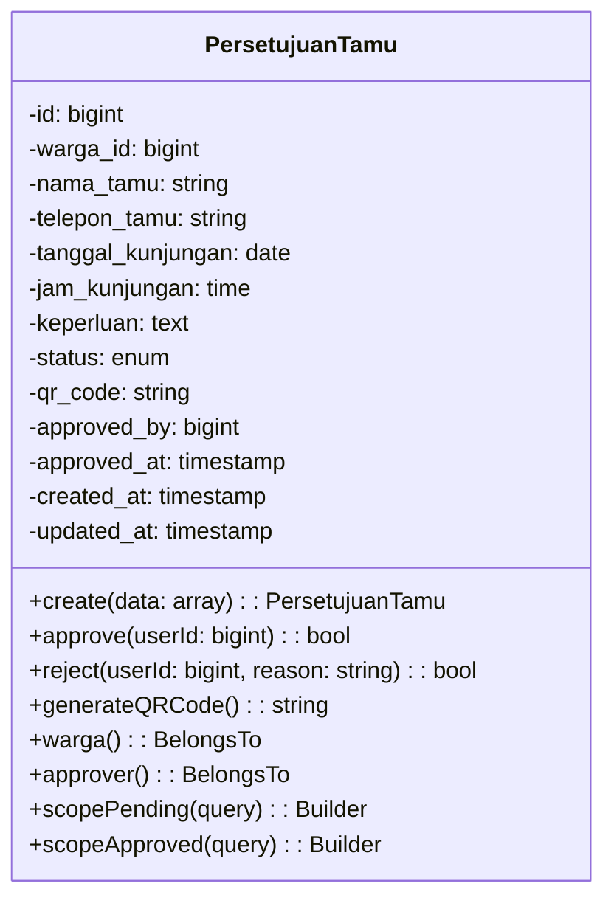
```mermaid
classDiagram
    class PersetujuanTamu {
        -id: bigint
        -warga_id: bigint
        -nama_tamu: string
        -telepon_tamu: string
        -tanggal_kunjungan: date
        -jam_kunjungan: time
        -keperluan: text
        -status: enum
        -qr_code: string
        -approved_by: bigint
        -approved_at: timestamp
        -created_at: timestamp
        -updated_at: timestamp
        
        +create(data: array): PersetujuanTamu
        +approve(userId: bigint): bool
        +reject(userId: bigint, reason: string): bool
        +generateQRCode(): string
        +warga(): BelongsTo
        +approver(): BelongsTo
        +scopePending(query): Builder
        +scopeApproved(query): Builder
    }
```

### 6. 📝 LogAktivitas Model

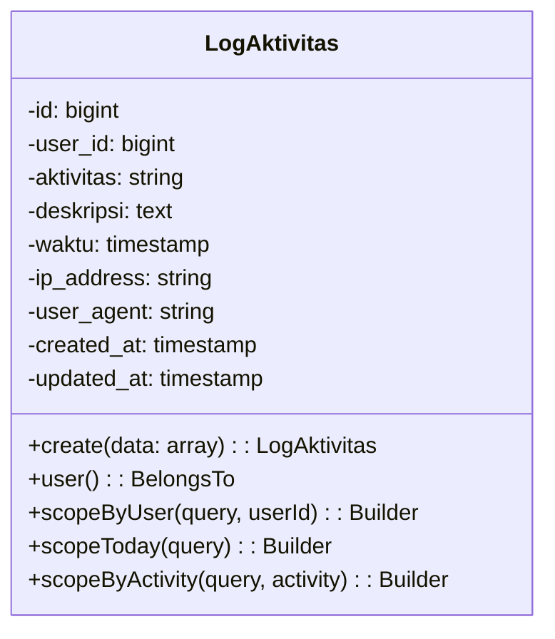
```mermaid
classDiagram
    class LogAktivitas {
        -id: bigint
        -user_id: bigint
        -aktivitas: string
        -deskripsi: text
        -waktu: timestamp
        -ip_address: string
        -user_agent: string
        -created_at: timestamp
        -updated_at: timestamp
        
        +create(data: array): LogAktivitas
        +user(): BelongsTo
        +scopeByUser(query, userId): Builder
        +scopeToday(query): Builder
        +scopeByActivity(query, activity): Builder
    }
```

## 🎯 Class Diagram - Controller Classes

### 7. 🎮 SatpamController

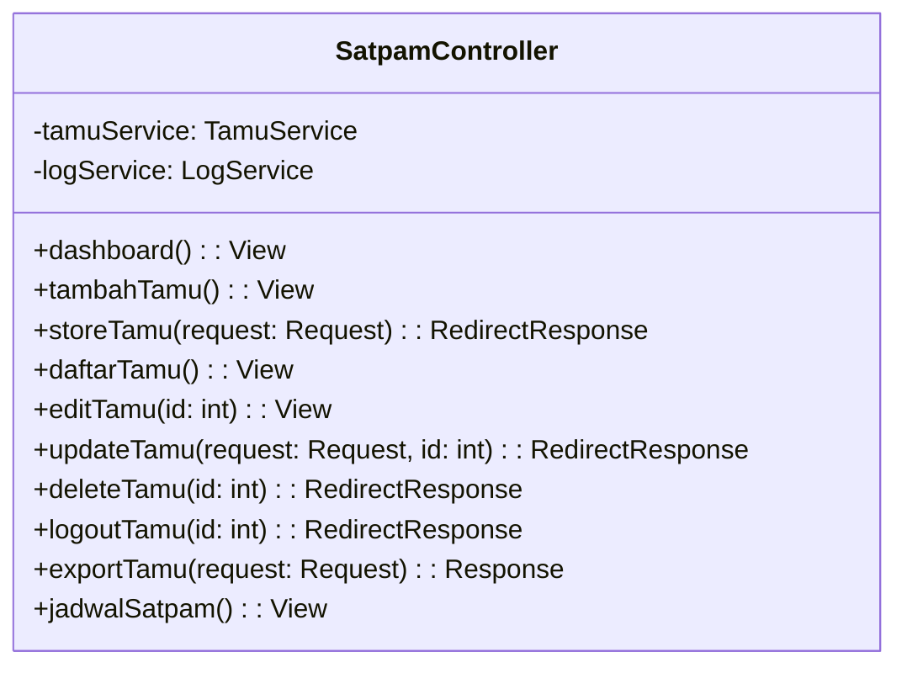
```mermaid
classDiagram
    class SatpamController {
        -tamuService: TamuService
        -logService: LogService
        
        +dashboard(): View
        +tambahTamu(): View
        +storeTamu(request: Request): RedirectResponse
        +daftarTamu(): View
        +editTamu(id: int): View
        +updateTamu(request: Request, id: int): RedirectResponse
        +deleteTamu(id: int): RedirectResponse
        +logoutTamu(id: int): RedirectResponse
        +exportTamu(request: Request): Response
        +jadwalSatpam(): View
    }
```

### 8. 🔐 AuthSatpamController

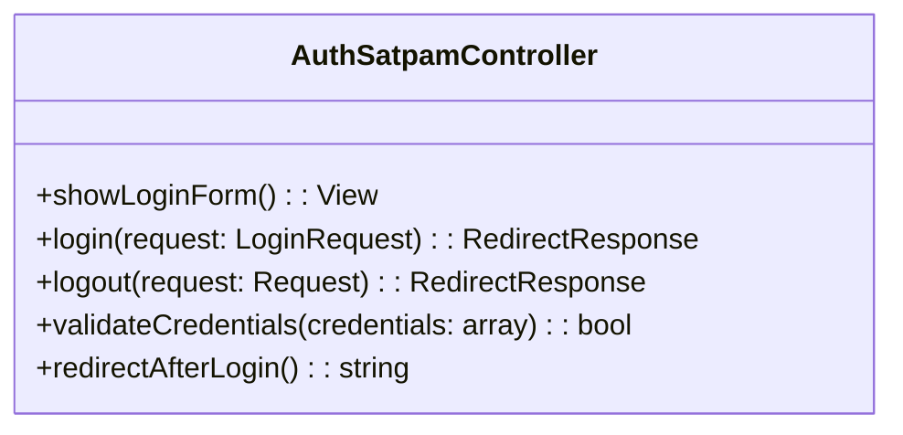
```mermaid
classDiagram
    class AuthSatpamController {
        +showLoginForm(): View
        +login(request: LoginRequest): RedirectResponse
        +logout(request: Request): RedirectResponse
        +validateCredentials(credentials: array): bool
        +redirectAfterLogin(): string
    }
```

### 9. ⚙️ AdminController (Filament)

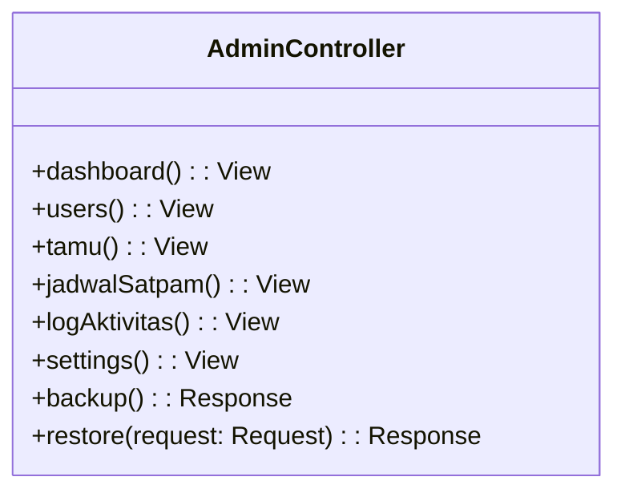
```mermaid
classDiagram
    class AdminController {
        +dashboard(): View
        +users(): View
        +tamu(): View
        +jadwalSatpam(): View
        +logAktivitas(): View
        +settings(): View
        +backup(): Response
        +restore(request: Request): Response
    }
```

## 🎯 Class Diagram - Service Classes

### 10. 🛠️ TamuService

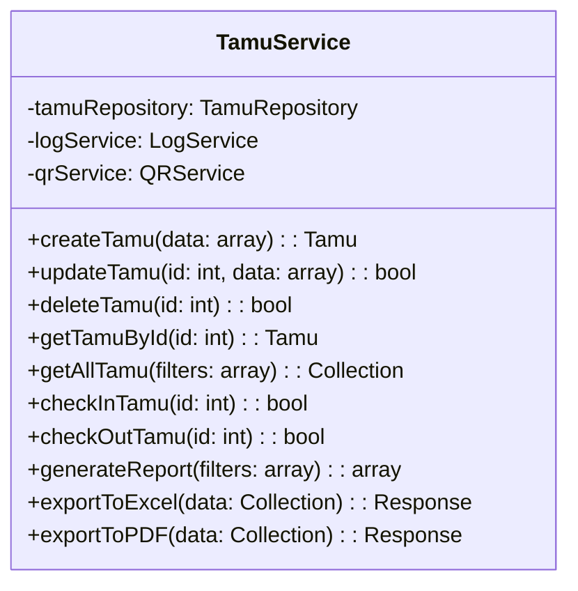
```mermaid
classDiagram
    class TamuService {
        -tamuRepository: TamuRepository
        -logService: LogService
        -qrService: QRService
        
        +createTamu(data: array): Tamu
        +updateTamu(id: int, data: array): bool
        +deleteTamu(id: int): bool
        +getTamuById(id: int): Tamu
        +getAllTamu(filters: array): Collection
        +checkInTamu(id: int): bool
        +checkOutTamu(id: int): bool
        +generateReport(filters: array): array
        +exportToExcel(data: Collection): Response
        +exportToPDF(data: Collection): Response
    }
```

### 11. 📊 LogService

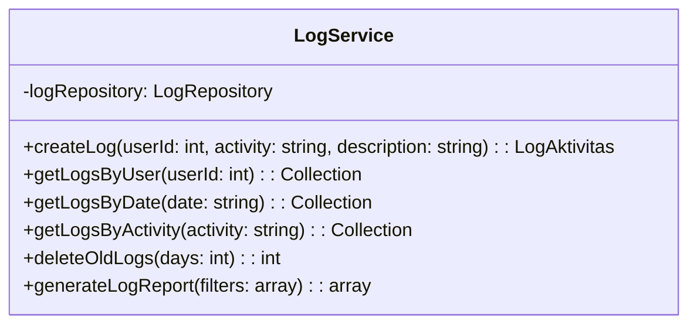
```mermaid
classDiagram
    class LogService {
        -logRepository: LogRepository
        
        +createLog(userId: int, activity: string, description: string): LogAktivitas
        +getLogsByUser(userId: int): Collection
        +getLogsByDate(date: string): Collection
        +getLogsByActivity(activity: string): Collection
        +deleteOldLogs(days: int): int
        +generateLogReport(filters: array): array
    }
```

### 12. 📱 QRService (Future)

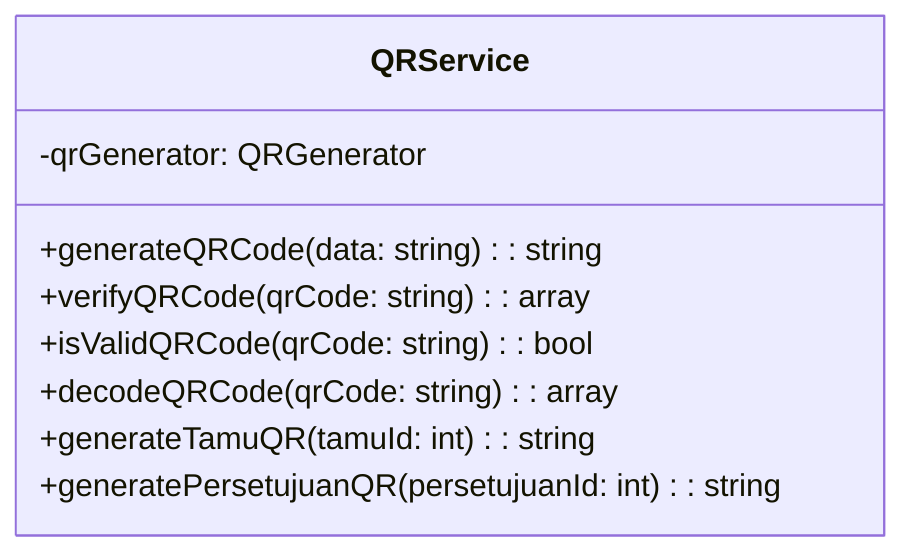
```mermaid
classDiagram
    class QRService {
        -qrGenerator: QRGenerator
        
        +generateQRCode(data: string): string
        +verifyQRCode(qrCode: string): array
        +isValidQRCode(qrCode: string): bool
        +decodeQRCode(qrCode: string): array
        +generateTamuQR(tamuId: int): string
        +generatePersetujuanQR(persetujuanId: int): string
    }
```

### 13. 📧 NotificationService (Future)

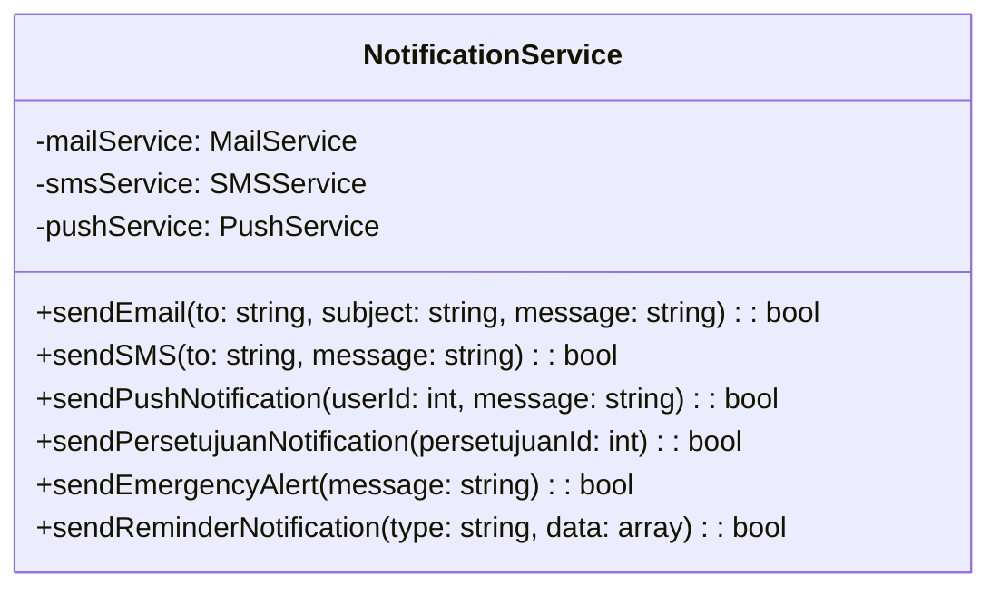
```mermaid
classDiagram
    class NotificationService {
        -mailService: MailService
        -smsService: SMSService
        -pushService: PushService
        
        +sendEmail(to: string, subject: string, message: string): bool
        +sendSMS(to: string, message: string): bool
        +sendPushNotification(userId: int, message: string): bool
        +sendPersetujuanNotification(persetujuanId: int): bool
        +sendEmergencyAlert(message: string): bool
        +sendReminderNotification(type: string, data: array): bool
    }
```

## 🎯 Class Diagram - Repository Classes

### 14. 🗄️ TamuRepository

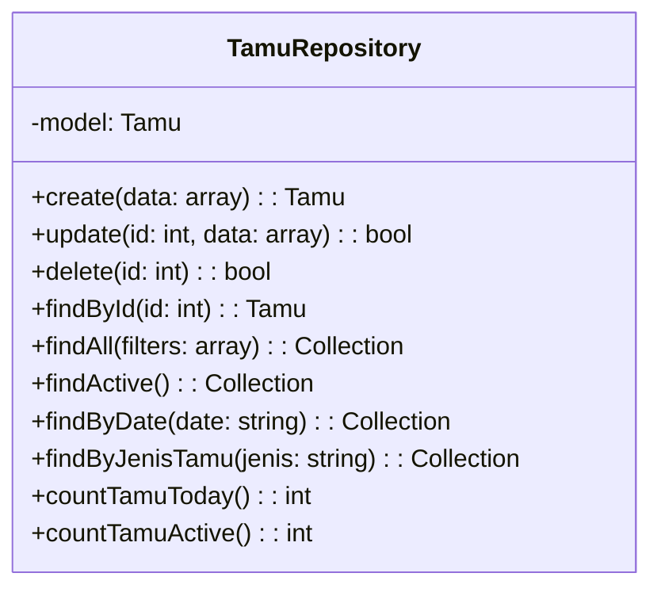
```mermaid
classDiagram
    class TamuRepository {
        -model: Tamu
        
        +create(data: array): Tamu
        +update(id: int, data: array): bool
        +delete(id: int): bool
        +findById(id: int): Tamu
        +findAll(filters: array): Collection
        +findActive(): Collection
        +findByDate(date: string): Collection
        +findByJenisTamu(jenis: string): Collection
        +countTamuToday(): int
        +countTamuActive(): int
    }
```

### 15. 👤 UserRepository

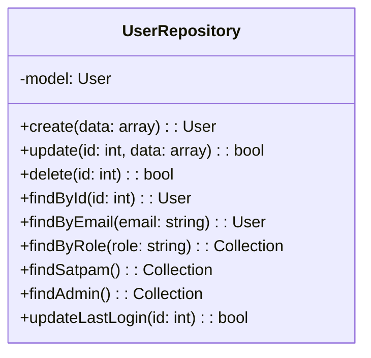
```mermaid
classDiagram
    class UserRepository {
        -model: User
        
        +create(data: array): User
        +update(id: int, data: array): bool
        +delete(id: int): bool
        +findById(id: int): User
        +findByEmail(email: string): User
        +findByRole(role: string): Collection
        +findSatpam(): Collection
        +findAdmin(): Collection
        +updateLastLogin(id: int): bool
    }
```

## 🎯 Class Relationships

### 16. 🔗 Model Relationships

```mermaid
classDiagram
    User ||--o{ JadwalSatpam : has_many
    User ||--o{ LogAktivitas : has_many
    User ||--o| Warga : has_one
    
    Warga ||--o{ PersetujuanTamu : has_many
    Warga ||--o{ BookingFasilitas : has_many
    Warga ||--o{ Komplain : has_many
    
    PersetujuanTamu }o--|| User : approved_by
    PersetujuanTamu ||--o| Tamu : generates
    
    Tamu }o--|| PersetujuanTamu : from_approval
    
    class User {
        +jadwalSatpam()
        +logAktivitas()
        +warga()
    }
    
    class Warga {
        +user()
        +persetujuanTamu()
        +bookingFasilitas()
        +komplain()
    }
    
    class PersetujuanTamu {
        +warga()
        +approver()
        +tamu()
    }
    
    class JadwalSatpam {
        +user()
    }
    
    class LogAktivitas {
        +user()
    }
```

### 17. 🏗️ Service Dependencies

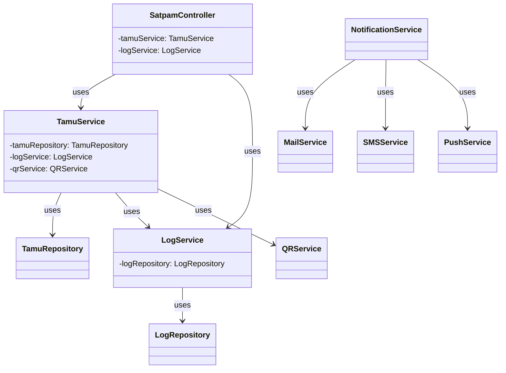
```mermaid
classDiagram
    SatpamController --> TamuService : uses
    SatpamController --> LogService : uses
    
    TamuService --> TamuRepository : uses
    TamuService --> LogService : uses
    TamuService --> QRService : uses
    
    LogService --> LogRepository : uses
    
    NotificationService --> MailService : uses
    NotificationService --> SMSService : uses
    NotificationService --> PushService : uses
    
    class SatpamController {
        -tamuService: TamuService
        -logService: LogService
    }
    
    class TamuService {
        -tamuRepository: TamuRepository
        -logService: LogService
        -qrService: QRService
    }
    
    class LogService {
        -logRepository: LogRepository
    }
```

## 🎯 Interface Classes

### 18. 📋 Repository Interfaces

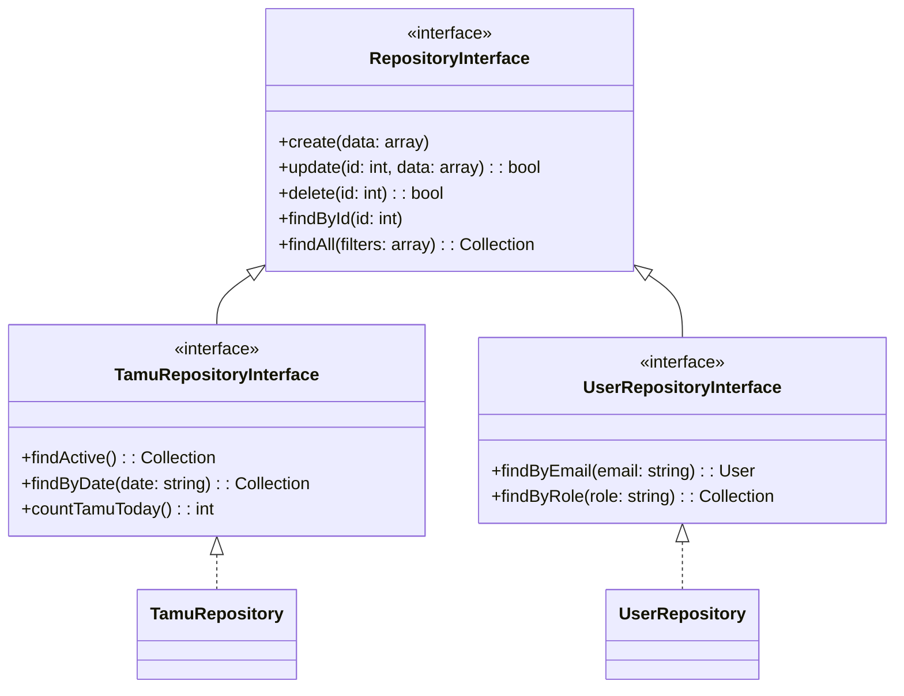
```mermaid
classDiagram
    class RepositoryInterface {
        <<interface>>
        +create(data: array)
        +update(id: int, data: array): bool
        +delete(id: int): bool
        +findById(id: int)
        +findAll(filters: array): Collection
    }
    
    class TamuRepositoryInterface {
        <<interface>>
        +findActive(): Collection
        +findByDate(date: string): Collection
        +countTamuToday(): int
    }
    
    class UserRepositoryInterface {
        <<interface>>
        +findByEmail(email: string): User
        +findByRole(role: string): Collection
    }
    
    RepositoryInterface <|-- TamuRepositoryInterface
    RepositoryInterface <|-- UserRepositoryInterface
    
    TamuRepositoryInterface <|.. TamuRepository
    UserRepositoryInterface <|.. UserRepository
```

### 19. 🛠️ Service Interfaces

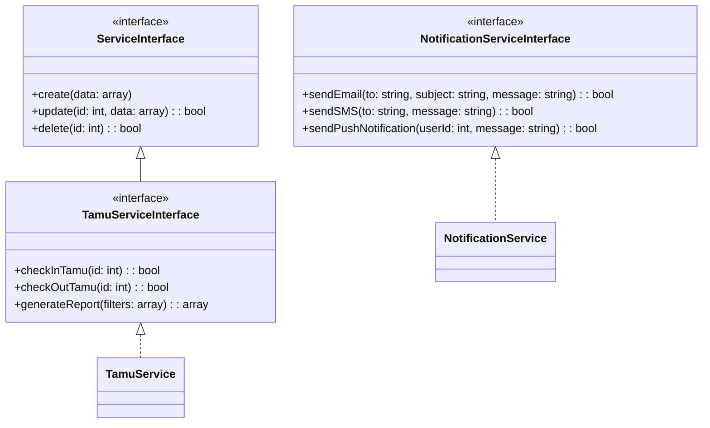
```mermaid
classDiagram
    class ServiceInterface {
        <<interface>>
        +create(data: array)
        +update(id: int, data: array): bool
        +delete(id: int): bool
    }
    
    class TamuServiceInterface {
        <<interface>>
        +checkInTamu(id: int): bool
        +checkOutTamu(id: int): bool
        +generateReport(filters: array): array
    }
    
    class NotificationServiceInterface {
        <<interface>>
        +sendEmail(to: string, subject: string, message: string): bool
        +sendSMS(to: string, message: string): bool
        +sendPushNotification(userId: int, message: string): bool
    }
    
    ServiceInterface <|-- TamuServiceInterface
    
    TamuServiceInterface <|.. TamuService
    NotificationServiceInterface <|.. NotificationService
```

## 🎯 Abstract Classes

### 20. 🏗️ Base Classes

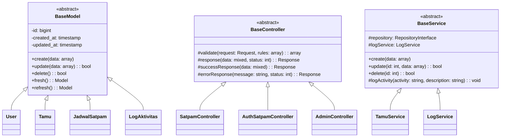
```mermaid
classDiagram
    class BaseModel {
        <<abstract>>
        -id: bigint
        -created_at: timestamp
        -updated_at: timestamp
        
        +create(data: array)
        +update(data: array): bool
        +delete(): bool
        +fresh(): Model
        +refresh(): Model
    }
    
    class BaseController {
        <<abstract>>
        #validate(request: Request, rules: array): array
        #response(data: mixed, status: int): Response
        #successResponse(data: mixed): Response
        #errorResponse(message: string, status: int): Response
    }
    
    class BaseService {
        <<abstract>>
        #repository: RepositoryInterface
        #logService: LogService
        
        +create(data: array)
        +update(id: int, data: array): bool
        +delete(id: int): bool
        #logActivity(activity: string, description: string): void
    }
    
    BaseModel <|-- User
    BaseModel <|-- Tamu
    BaseModel <|-- JadwalSatpam
    BaseModel <|-- LogAktivitas
    
    BaseController <|-- SatpamController
    BaseController <|-- AuthSatpamController
    BaseController <|-- AdminController
    
    BaseService <|-- TamuService
    BaseService <|-- LogService
```

## 🎯 Design Patterns

### 21. 🎨 Observer Pattern (Future)

```mermaid
classDiagram
    class EventObserver {
        <<interface>>
        +handle(event: Event): void
    }
    
    class TamuCreatedObserver {
        +handle(event: TamuCreated): void
    }
    
    class PersetujuanApprovedObserver {
        +handle(event: PersetujuanApproved): void
    }
    
    class EmergencyAlertObserver {
        +handle(event: EmergencyAlert): void
    }
    
    EventObserver <|.. TamuCreatedObserver
    EventObserver <|.. PersetujuanApprovedObserver
    EventObserver <|.. EmergencyAlertObserver
```

### 22. 🏭 Factory Pattern

```mermaid
classDiagram
    class ReportFactory {
        +createReport(type: string): ReportInterface
        +createExcelReport(): ExcelReport
        +createPDFReport(): PDFReport
        +createHTMLReport(): HTMLReport
    }
    
    class ReportInterface {
        <<interface>>
        +generate(data: array): Response
        +setTemplate(template: string): void
        +setData(data: array): void
    }
    
    class ExcelReport {
        +generate(data: array): Response
        +setTemplate(template: string): void
        +setData(data: array): void
    }
    
    class PDFReport {
        +generate(data: array): Response
        +setTemplate(template: string): void
        +setData(data: array): void
    }
    
    ReportInterface <|.. ExcelReport
    ReportInterface <|.. PDFReport
    
    ReportFactory --> ReportInterface : creates
```

## 📊 Class Metrics

### **Class Complexity Metrics:**

| Class | Methods | Properties | Complexity | Status |
|-------|---------|------------|------------|---------|
| User | 8 | 8 | Medium | ✅ Stable |
| Tamu | 12 | 12 | High | ✅ Stable |
| TamuService | 15 | 3 | High | ✅ Stable |
| SatpamController | 10 | 2 | Medium | ✅ Stable |
| LogService | 8 | 1 | Low | ✅ Stable |

### **Inheritance Depth:**

- BaseModel → User/Tamu/etc. (Depth: 2)
- BaseController → SatpamController/etc. (Depth: 2)
- BaseService → TamuService/etc. (Depth: 2)

### **Coupling Metrics:**

- **Low Coupling**: LogService, QRService
- **Medium Coupling**: TamuService, UserService
- **High Coupling**: SatpamController (by design)

## 🎯 Future Class Extensions

### 23. 🚀 Planned Classes

```mermaid
classDiagram
    class FasilitasService {
        +createBooking(data: array): BookingFasilitas
        +approveBooking(id: int): bool
        +cancelBooking(id: int): bool
        +getAvailableSlots(fasilitasId: int, date: string): array
    }
    
    class EmergencyService {
        +triggerAlert(type: string, location: string): bool
        +broadcastAlert(message: string): bool
        +logEmergency(data: array): EmergencyLog
        +escalateAlert(alertId: int): bool
    }
    
    class AnalyticsService {
        +generateTrafficReport(): array
        +generateSecurityReport(): array
        +generateUsageReport(): array
        +predictiveAnalysis(type: string): array
    }
    
    class MobileAPIController {
        +login(request: Request): JsonResponse
        +getTamuList(): JsonResponse
        +scanQRCode(request: Request): JsonResponse
        +submitEmergency(request: Request): JsonResponse
    }
```

---

## 📞 Support & Updates

Dokumentasi Class Diagram ini akan diupdate seiring dengan perkembangan sistem. Untuk pertanyaan atau saran, silakan hubungi tim development.

**🔗 Related Documents:**
- [Use Case Diagram](use-case-diagram.md)
- [Activity Diagram](activity-diagram.md)
- [Database Design](database-design.md)
- [API Documentation](api-documentation.md)