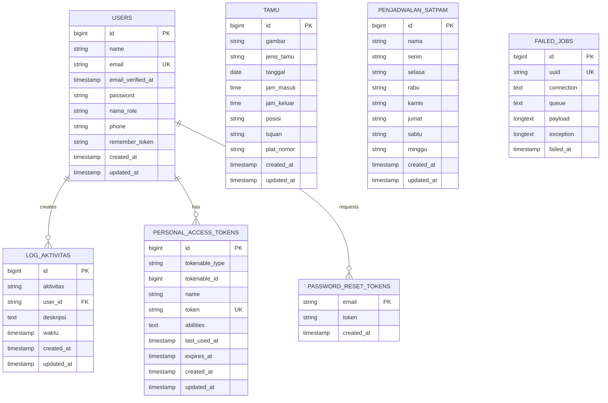

# Dokumentasi Database - Sistem Administrasi Tamu

## Daftar Isi
1. [Overview Database](#overview-database)
2. [Entity Relationship Diagram (ERD)](#entity-relationship-diagram-erd)
3. [Struktur Tabel](#struktur-tabel)
4. [Relasi Antar Tabel](#relasi-antar-tabel)
5. [Indeks dan Constraint](#indeks-dan-constraint)
6. [Query Optimization](#query-optimization)
7. [Backup dan Recovery](#backup-dan-recovery)

## Overview Database

Sistem Administrasi Tamu menggunakan database MySQL dengan Laravel Framework. Database ini dirancang untuk mengelola data tamu, penjadwalan satpam, log aktivitas, dan manajemen pengguna.

### Informasi Database
- **Database Engine**: MySQL 8.0+
- **Framework**: Laravel 10.x
- **ORM**: Eloquent
- **Migration System**: Laravel Migration
- **Character Set**: utf8mb4_unicode_ci

## Entity Relationship Diagram (ERD)



## Struktur Tabel

### 1. Tabel `users`
Menyimpan data pengguna sistem (admin, satpam, dll.)

| Field | Type | Null | Key | Default | Extra |
|-------|------|------|-----|---------|-------|
| id | bigint(20) unsigned | NO | PRI | NULL | auto_increment |
| name | varchar(255) | NO | | NULL | |
| email | varchar(255) | NO | UNI | NULL | |
| email_verified_at | timestamp | YES | | NULL | |
| password | varchar(255) | NO | | NULL | |
| nama_role | varchar(255) | NO | | user | |
| phone | varchar(255) | NO | | 08 | |
| remember_token | varchar(100) | YES | | NULL | |
| created_at | timestamp | YES | | NULL | |
| updated_at | timestamp | YES | | NULL | |

**Deskripsi Field:**
- `id`: Primary key, auto increment
- `name`: Nama lengkap pengguna
- `email`: Email pengguna (unique)
- `email_verified_at`: Timestamp verifikasi email
- `password`: Password terenkripsi
- `nama_role`: Role pengguna (admin, satpam, user)
- `phone`: Nomor telepon pengguna
- `remember_token`: Token untuk remember me
- `created_at`, `updated_at`: Timestamp Laravel

### 2. Tabel `tamu`
Menyimpan data tamu yang berkunjung

| Field | Type | Null | Key | Default | Extra |
|-------|------|------|-----|---------|-------|
| id | bigint(20) unsigned | NO | PRI | NULL | auto_increment |
| gambar | varchar(255) | NO | | NULL | |
| jenis_tamu | varchar(255) | NO | | NULL | |
| tanggal | date | NO | | NULL | |
| jam_masuk | time | NO | | NULL | |
| jam_keluar | time | YES | | NULL | |
| posisi | varchar(255) | NO | | NULL | |
| tujuan | varchar(255) | NO | | NULL | |
| plat_nomor | varchar(255) | NO | | NULL | |
| created_at | timestamp | YES | | NULL | |
| updated_at | timestamp | YES | | NULL | |

**Deskripsi Field:**
- `id`: Primary key, auto increment
- `gambar`: Path/URL foto tamu
- `jenis_tamu`: Kategori tamu (VIP, Reguler, Vendor, dll.)
- `tanggal`: Tanggal kunjungan
- `jam_masuk`: Waktu masuk tamu
- `jam_keluar`: Waktu keluar tamu (nullable)
- `posisi`: Lokasi/posisi tamu berada
- `tujuan`: Tujuan kunjungan tamu
- `plat_nomor`: Nomor plat kendaraan tamu

### 3. Tabel `penjadwalan_satpam`
Menyimpan jadwal kerja satpam

| Field | Type | Null | Key | Default | Extra |
|-------|------|------|-----|---------|-------|
| id | bigint(20) unsigned | NO | PRI | NULL | auto_increment |
| nama | varchar(255) | NO | | NULL | |
| senin | varchar(255) | NO | | NULL | |
| selasa | varchar(255) | NO | | NULL | |
| rabu | varchar(255) | NO | | NULL | |
| kamis | varchar(255) | NO | | NULL | |
| jumat | varchar(255) | NO | | NULL | |
| sabtu | varchar(255) | NO | | NULL | |
| minggu | varchar(255) | NO | | NULL | |
| created_at | timestamp | YES | | NULL | |
| updated_at | timestamp | YES | | NULL | |

**Deskripsi Field:**
- `id`: Primary key, auto increment
- `nama`: Nama satpam
- `senin` - `minggu`: Jadwal kerja per hari (shift pagi/siang/malam/libur)

### 4. Tabel `log_aktivitas`
Menyimpan log aktivitas pengguna sistem

| Field | Type | Null | Key | Default | Extra |
|-------|------|------|-----|---------|-------|
| id | bigint(20) unsigned | NO | PRI | NULL | auto_increment |
| aktivitas | varchar(255) | NO | | NULL | |
| user_id | varchar(255) | NO | | NULL | |
| deskripsi | text | NO | | NULL | |
| waktu | timestamp | NO | | NULL | |
| created_at | timestamp | YES | | NULL | |
| updated_at | timestamp | YES | | NULL | |

**Deskripsi Field:**
- `id`: Primary key, auto increment
- `aktivitas`: Jenis aktivitas yang dilakukan
- `user_id`: ID pengguna yang melakukan aktivitas
- `deskripsi`: Deskripsi detail aktivitas
- `waktu`: Timestamp aktivitas dilakukan

### 5. Tabel `personal_access_tokens`
Menyimpan token akses personal untuk API

| Field | Type | Null | Key | Default | Extra |
|-------|------|------|-----|---------|-------|
| id | bigint(20) unsigned | NO | PRI | NULL | auto_increment |
| tokenable_type | varchar(255) | NO | | NULL | |
| tokenable_id | bigint(20) unsigned | NO | | NULL | |
| name | varchar(255) | NO | | NULL | |
| token | varchar(64) | NO | UNI | NULL | |
| abilities | text | YES | | NULL | |
| last_used_at | timestamp | YES | | NULL | |
| expires_at | timestamp | YES | | NULL | |
| created_at | timestamp | YES | | NULL | |
| updated_at | timestamp | YES | | NULL | |

### 6. Tabel `password_reset_tokens`
Menyimpan token reset password

| Field | Type | Null | Key | Default | Extra |
|-------|------|------|-----|---------|-------|
| email | varchar(255) | NO | PRI | NULL | |
| token | varchar(255) | NO | | NULL | |
| created_at | timestamp | YES | | NULL | |

### 7. Tabel `failed_jobs`
Menyimpan job yang gagal dieksekusi

| Field | Type | Null | Key | Default | Extra |
|-------|------|------|-----|---------|-------|
| id | bigint(20) unsigned | NO | PRI | NULL | auto_increment |
| uuid | varchar(255) | NO | UNI | NULL | |
| connection | text | NO | | NULL | |
| queue | text | NO | | NULL | |
| payload | longtext | NO | | NULL | |
| exception | longtext | NO | | NULL | |
| failed_at | timestamp | NO | | CURRENT_TIMESTAMP | |

## Relasi Antar Tabel

### 1. Users → Log Aktivitas
- **Relasi**: One to Many
- **Foreign Key**: `log_aktivitas.user_id` → `users.id`
- **Deskripsi**: Satu user dapat memiliki banyak log aktivitas

### 2. Users → Personal Access Tokens
- **Relasi**: One to Many (Polymorphic)
- **Foreign Key**: `personal_access_tokens.tokenable_id` → `users.id`
- **Deskripsi**: Satu user dapat memiliki banyak token akses

### 3. Users → Password Reset Tokens
- **Relasi**: One to Many
- **Foreign Key**: `password_reset_tokens.email` → `users.email`
- **Deskripsi**: Satu user dapat memiliki token reset password

## Indeks dan Constraint

### Primary Keys
- `users.id`
- `tamu.id`
- `penjadwalan_satpam.id`
- `log_aktivitas.id`
- `personal_access_tokens.id`
- `password_reset_tokens.email`
- `failed_jobs.id`

### Unique Keys
- `users.email`
- `personal_access_tokens.token`
- `failed_jobs.uuid`

### Indexes yang Direkomendasikan
```sql
-- Index untuk pencarian tamu berdasarkan tanggal
CREATE INDEX idx_tamu_tanggal ON tamu(tanggal);

-- Index untuk pencarian tamu berdasarkan jenis
CREATE INDEX idx_tamu_jenis ON tamu(jenis_tamu);

-- Index untuk log aktivitas berdasarkan user dan waktu
CREATE INDEX idx_log_user_waktu ON log_aktivitas(user_id, waktu);

-- Index untuk penjadwalan satpam berdasarkan nama
CREATE INDEX idx_satpam_nama ON penjadwalan_satpam(nama);
```

## Query Optimization

### 1. Query Tamu Hari Ini
```sql
SELECT * FROM tamu 
WHERE tanggal = CURDATE() 
ORDER BY jam_masuk DESC;
```

### 2. Query Statistik Tamu Bulanan
```sql
SELECT 
    DATE_FORMAT(tanggal, '%Y-%m') as bulan,
    COUNT(*) as total_tamu,
    COUNT(CASE WHEN jam_keluar IS NOT NULL THEN 1 END) as tamu_keluar
FROM tamu 
WHERE tanggal >= DATE_SUB(CURDATE(), INTERVAL 12 MONTH)
GROUP BY DATE_FORMAT(tanggal, '%Y-%m')
ORDER BY bulan DESC;
```

### 3. Query Log Aktivitas User
```sql
SELECT la.*, u.name as user_name
FROM log_aktivitas la
JOIN users u ON la.user_id = u.id
WHERE la.waktu >= DATE_SUB(NOW(), INTERVAL 7 DAY)
ORDER BY la.waktu DESC;
```

### 4. Query Jadwal Satpam Hari Ini
```sql
SELECT nama,
    CASE DAYOFWEEK(CURDATE())
        WHEN 1 THEN minggu
        WHEN 2 THEN senin
        WHEN 3 THEN selasa
        WHEN 4 THEN rabu
        WHEN 5 THEN kamis
        WHEN 6 THEN jumat
        WHEN 7 THEN sabtu
    END as jadwal_hari_ini
FROM penjadwalan_satpam
ORDER BY nama;
```

## Backup dan Recovery

### 1. Backup Database
```bash
# Backup lengkap
mysqldump -u username -p admin_tamu > backup_admin_tamu_$(date +%Y%m%d_%H%M%S).sql

# Backup hanya struktur
mysqldump -u username -p --no-data admin_tamu > structure_admin_tamu.sql

# Backup hanya data
mysqldump -u username -p --no-create-info admin_tamu > data_admin_tamu.sql
```

### 2. Restore Database
```bash
# Restore dari backup
mysql -u username -p admin_tamu < backup_admin_tamu_20241201_120000.sql
```

### 3. Laravel Migration Commands
```bash
# Menjalankan migration
php artisan migrate

# Rollback migration
php artisan migrate:rollback

# Reset dan jalankan ulang semua migration
php artisan migrate:fresh

# Seed database
php artisan db:seed
```

## Security Considerations

### 1. Enkripsi Password
- Menggunakan bcrypt untuk hashing password
- Minimum 8 karakter dengan kombinasi huruf, angka, dan simbol

### 2. SQL Injection Prevention
- Menggunakan Eloquent ORM dan Query Builder
- Prepared statements untuk raw queries
- Input validation dan sanitization

### 3. Data Sensitive
- Field password selalu terenkripsi
- Personal access tokens dengan expiration time
- Log aktivitas untuk audit trail

### 4. Access Control
- Role-based access control melalui field `nama_role`
- Middleware authentication untuk proteksi route
- Session management yang aman

## Maintenance

### 1. Regular Tasks
- Backup database harian
- Cleanup log aktivitas lama (> 6 bulan)
- Cleanup expired tokens
- Monitor performa query

### 2. Monitoring
- Database size dan growth
- Slow query log
- Connection pool usage
- Index effectiveness

### 3. Optimization
- Regular ANALYZE TABLE
- Index optimization berdasarkan query patterns
- Partitioning untuk tabel besar (jika diperlukan)

---

**Catatan**: Dokumentasi ini dibuat berdasarkan struktur database saat ini. Pastikan untuk memperbarui dokumentasi setiap kali ada perubahan skema database.

**Versi**: 1.0  
**Tanggal**: Desember 2024  
**Dibuat oleh**: Tim Development Sistem Administrasi Tamu