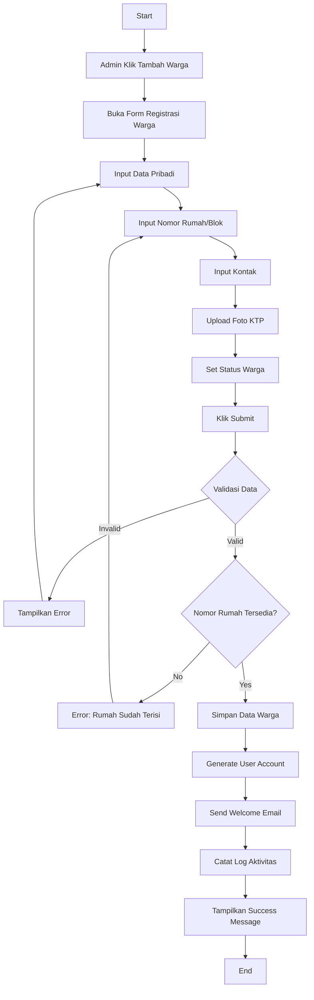
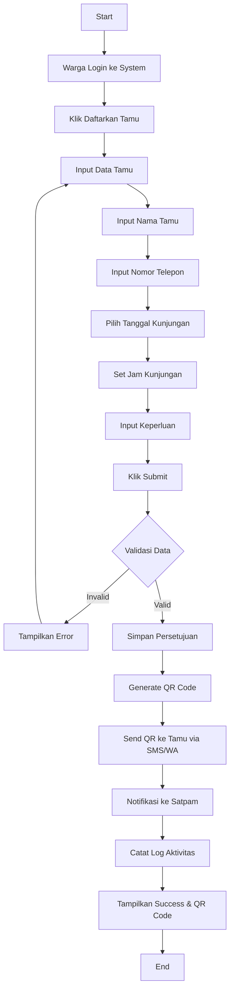
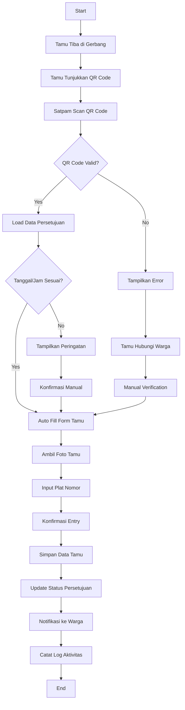
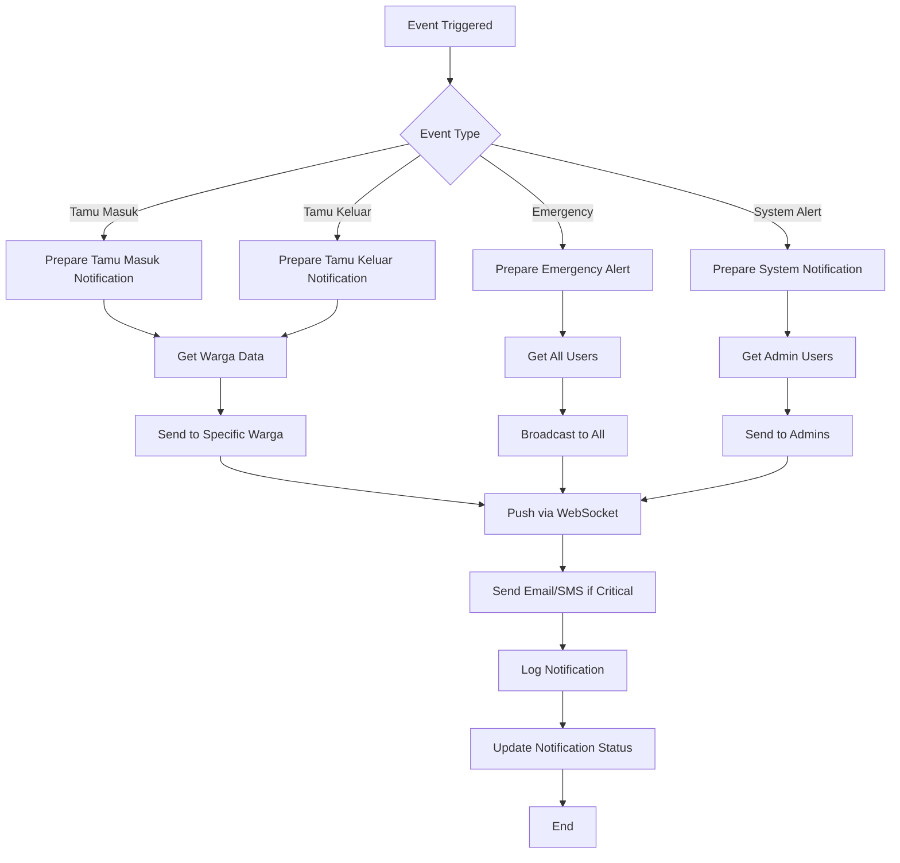
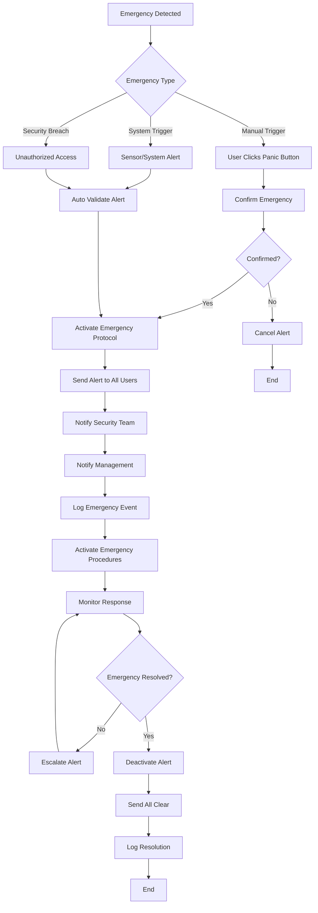
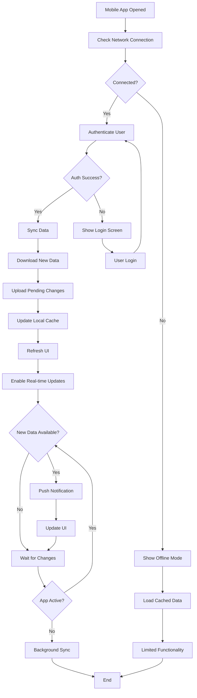
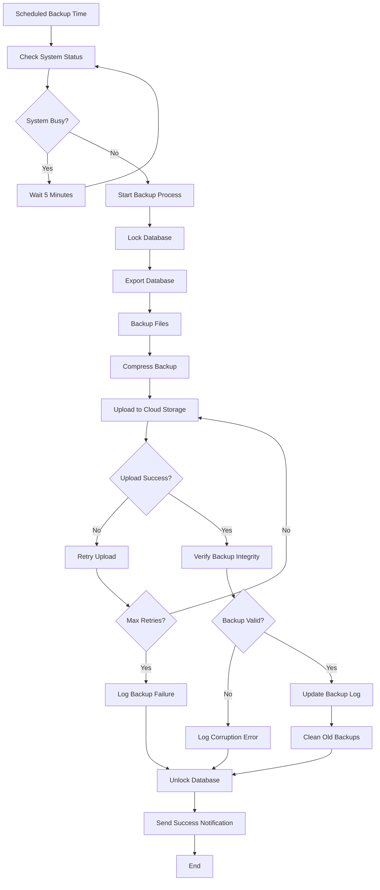
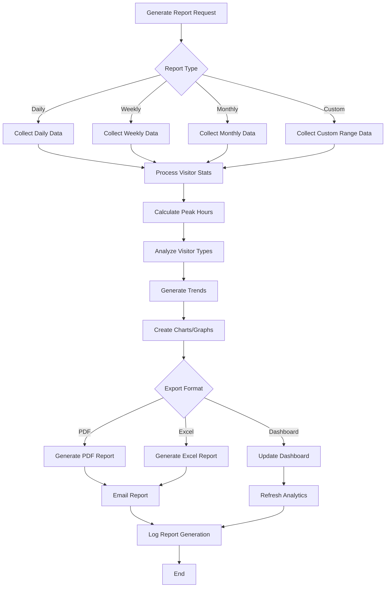

# Activity Diagrams - Fitur Masa Depan Sistem Admin Tamu Perumahan

## 1. Activity Diagram - Registrasi Warga Baru



## 2. Activity Diagram - Persetujuan Tamu oleh Warga



## 3. Activity Diagram - Verifikasi Tamu dengan QR Code



## 4. Activity Diagram - Notifikasi Real-time



## 5. Activity Diagram - Booking Fasilitas

```mermaid
graph TD
    A[Start] --> B[Warga Login]
    B --> C[Pilih Menu Booking Fasilitas]
    C --> D[Lihat Fasilitas Tersedia]
    D --> E[Pilih Fasilitas]
    E --> F[Pilih Tanggal]
    F --> G[Pilih Jam]
    G --> H{Slot Tersedia?}
    H -->|No| I[Tampilkan Slot Alternatif]
    I --> G
    H -->|Yes| J[Input Keperluan]
    J --> K[Konfirmasi Booking]
    K --> L[Proses Pembayaran (jika ada)]
    L --> M{Pembayaran Berhasil?}
    M -->|No| N[Tampilkan Error Payment]
    N --> L
    M -->|Yes| O[Simpan Booking]
    O --> P[Generate Booking Code]
    P --> Q[Send Konfirmasi]
    Q --> R[Notifikasi ke Admin]
    R --> S[Catat Log Aktivitas]
    S --> T[End]
```

## 6. Activity Diagram - Manajemen Komplain

```mermaid
graph TD
    A[Start] --> B[Warga Login]
    B --> C[Klik Buat Komplain]
    C --> D[Pilih Kategori Komplain]
    D --> E[Input Deskripsi]
    E --> F[Upload Foto (opsional)]
    F --> G[Set Prioritas]
    G --> H[Submit Komplain]
    H --> I[Generate Ticket Number]
    I --> J[Assign ke Admin/Teknisi]
    J --> K[Send Notifikasi ke Assignee]
    K --> L[Update Status: Open]
    L --> M[Catat Log]
    M --> N{Admin Response}
    N -->|In Progress| O[Update Status: In Progress]
    N -->|Need Info| P[Request Additional Info]
    N -->|Resolved| Q[Update Status: Resolved]
    O --> R[Notifikasi ke Warga]
    P --> R
    Q --> S[Request Warga Confirmation]
    R --> T{Warga Satisfied?}
    S --> T
    T -->|No| U[Reopen Ticket]
    U --> N
    T -->|Yes| V[Close Ticket]
    V --> W[End]
```

## 7. Activity Diagram - Emergency Alert System



## 8. Activity Diagram - Mobile App Sync



## 9. Activity Diagram - Data Backup & Restore



## 10. Activity Diagram - Analytics & Reporting

