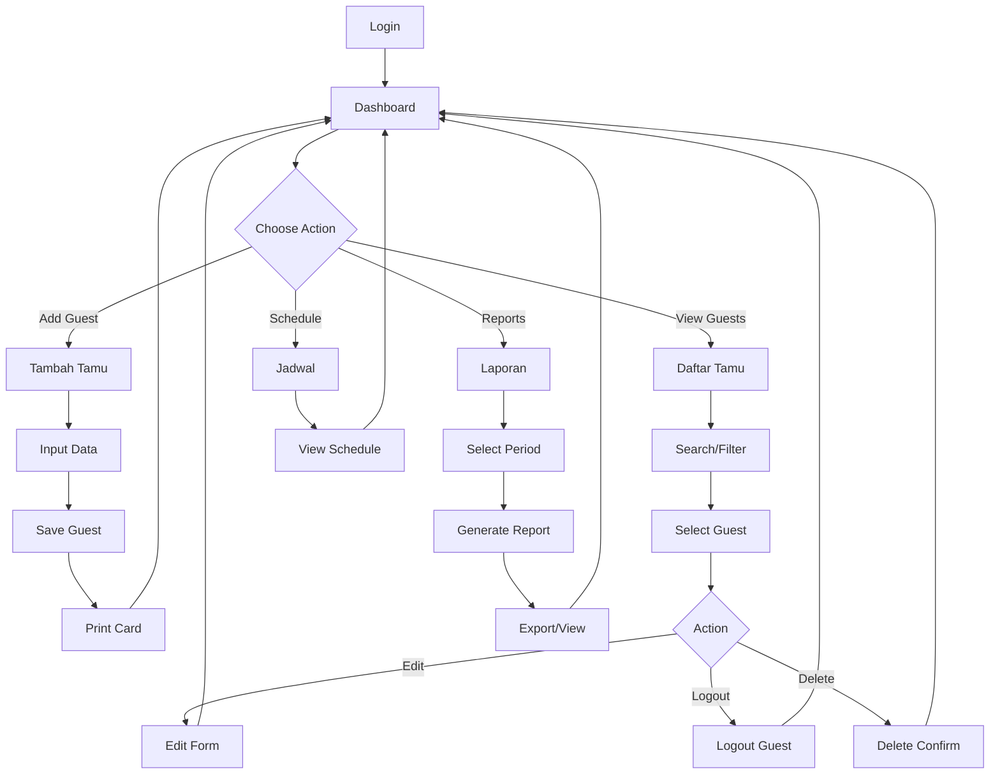
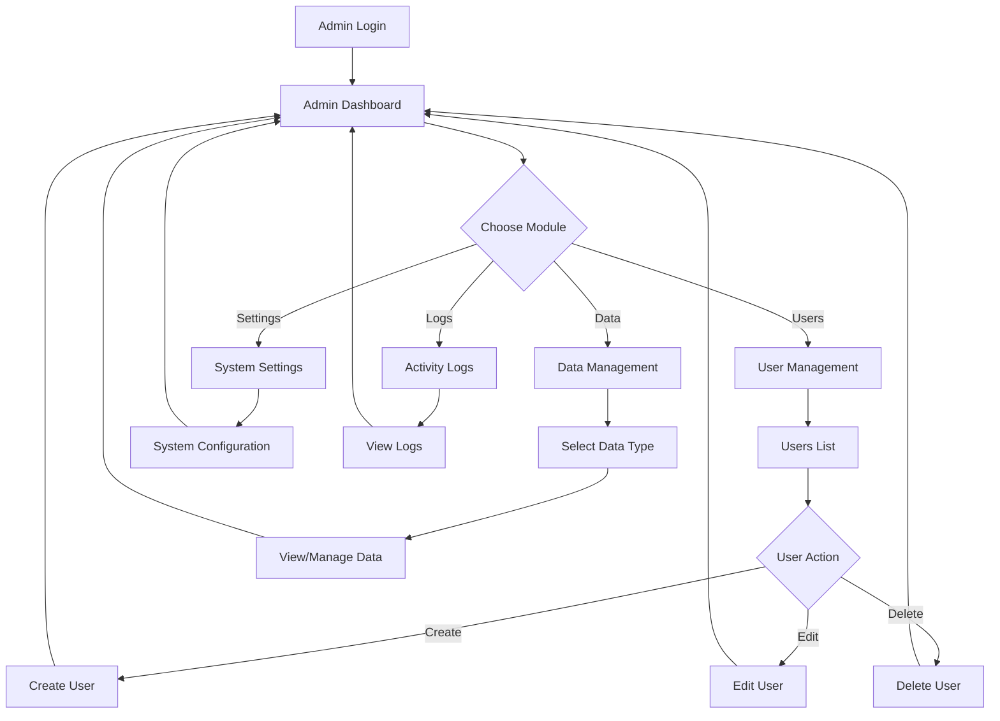
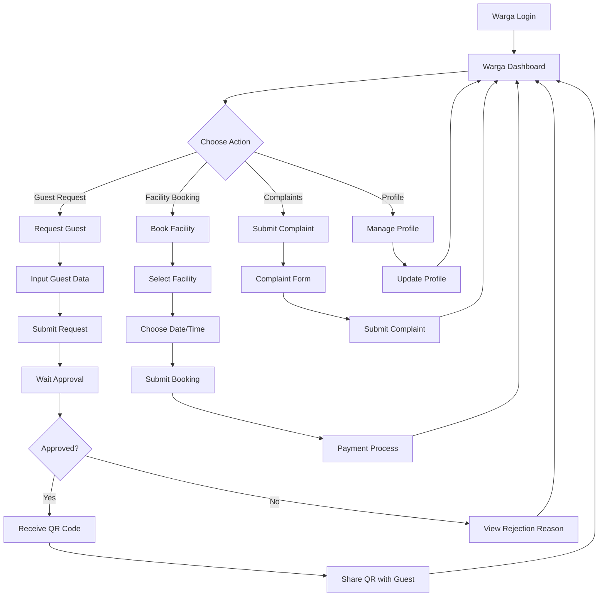

# 📋 Struktur Navigasi - Sistem Admin Tamu Perumahan

## 📖 Overview

Dokumentasi ini menjelaskan struktur navigasi lengkap dari sistem admin tamu perumahan, mencakup semua halaman, menu, dan alur navigasi untuk berbagai jenis pengguna.

## 🎯 Struktur Navigasi - Satpam Interface

### 1. 🏠 Dashboard Satpam

```
📊 Dashboard Satpam
├── 📈 Statistik Hari Ini
│   ├── Total Tamu Masuk
│   ├── Tamu Aktif (Belum Keluar)
│   ├── Total Kunjungan Bulan Ini
│   └── Rata-rata Durasi Kunjungan
├── 📋 Tamu Aktif Saat Ini
│   ├── Daftar Tamu yang Sedang Berkunjung
│   ├── Waktu Masuk
│   └── Durasi Kunjungan
├── 📊 Grafik Kunjungan
│   ├── Grafik Harian (7 hari terakhir)
│   ├── Grafik Mingguan (4 minggu terakhir)
│   └── Grafik Bulanan (12 bulan terakhir)
└── 🔔 Notifikasi & Alert
    ├── Tamu Baru Menunggu
    ├── Tamu Lama (>8 jam)
    └── System Alerts
```

### 2. 👥 Manajemen Tamu

```
👥 Manajemen Tamu
├── ➕ Tambah Tamu Baru
│   ├── Form Input Data Tamu
│   │   ├── Nama Lengkap
│   │   ├── Plat Nomor Kendaraan
│   │   ├── Jenis Tamu (Tamu Pribadi/Vendor/Kurir/dll)
│   │   ├── Tujuan Kunjungan
│   │   ├── Nomor Rumah Tujuan
│   │   ├── Foto Tamu (Optional)
│   │   └── Catatan Khusus
│   ├── Validasi Data
│   ├── Generate ID Tamu
│   └── Print Kartu Tamu
├── 📋 Daftar Tamu
│   ├── 🔍 Pencarian & Filter
│   │   ├── Cari berdasarkan Nama
│   │   ├── Filter berdasarkan Tanggal
│   │   ├── Filter berdasarkan Status
│   │   ├── Filter berdasarkan Jenis Tamu
│   │   └── Filter berdasarkan Nomor Rumah
│   ├── 📊 Tabel Data Tamu
│   │   ├── ID Tamu
│   │   ├── Nama
│   │   ├── Plat Nomor
│   │   ├── Waktu Masuk
│   │   ├── Waktu Keluar
│   │   ├── Status (Aktif/Selesai)
│   │   └── Aksi (Edit/Hapus/Logout)
│   └── 📄 Pagination
├── ✏️ Edit Data Tamu
│   ├── Form Edit (sama dengan form tambah)
│   ├── Update Data
│   └── Log Perubahan
├── 🚪 Logout Tamu
│   ├── Scan/Input ID Tamu
│   ├── Konfirmasi Data Tamu
│   ├── Update Waktu Keluar
│   ├── Hitung Durasi Kunjungan
│   └── Update Status
└── 🗑️ Hapus Data Tamu
    ├── Konfirmasi Penghapusan
    ├── Soft Delete
    └── Log Aktivitas
```

### 3. 📊 Laporan & Export

```
📊 Laporan & Export
├── 📈 Laporan Kunjungan
│   ├── 📅 Filter Periode
│   │   ├── Harian
│   │   ├── Mingguan
│   │   ├── Bulanan
│   │   └── Custom Range
│   ├── 📊 Statistik Kunjungan
│   │   ├── Total Kunjungan
│   │   ├── Rata-rata per Hari
│   │   ├── Peak Hours
│   │   └── Jenis Tamu Terbanyak
│   └── 📋 Detail Kunjungan
├── 📤 Export Data
│   ├── 📊 Export ke Excel
│   │   ├── Pilih Periode
│   │   ├── Pilih Kolom Data
│   │   └── Download File
│   ├── 📄 Export ke PDF
│   │   ├── Pilih Template
│   │   ├── Pilih Data
│   │   └── Generate PDF
│   └── 📋 Export ke CSV
└── 📊 Grafik & Visualisasi
    ├── Chart Kunjungan Harian
    ├── Chart Jenis Tamu
    ├── Chart Peak Hours
    └── Chart Trend Bulanan
```

### 4. 📅 Jadwal Satpam

```
📅 Jadwal Satpam
├── 📋 Jadwal Saya
│   ├── Jadwal Hari Ini
│   ├── Jadwal Minggu Ini
│   ├── Jadwal Bulan Ini
│   └── Riwayat Jadwal
├── 📊 Kalender Jadwal
│   ├── View Bulanan
│   ├── View Mingguan
│   └── View Harian
├── 🔄 Shift Management
│   ├── Shift Pagi (06:00-14:00)
│   ├── Shift Siang (14:00-22:00)
│   ├── Shift Malam (22:00-06:00)
│   └── Shift Khusus
└── 📝 Catatan Shift
    ├── Laporan Shift
    ├── Kejadian Khusus
    └── Serah Terima
```

## 🎯 Struktur Navigasi - Admin Panel (Filament)

### 5. ⚙️ Admin Dashboard

```
⚙️ Admin Dashboard
├── 📊 Overview Statistics
│   ├── Total Users
│   ├── Total Tamu (All Time)
│   ├── Active Sessions
│   └── System Status
├── 📈 Analytics
│   ├── User Activity
│   ├── System Performance
│   ├── Database Usage
│   └── Error Logs
├── 🔔 System Notifications
│   ├── Security Alerts
│   ├── System Updates
│   ├── Backup Status
│   └── Maintenance Reminders
└── 🚀 Quick Actions
    ├── Create New User
    ├── Backup Database
    ├── View System Logs
    └── System Settings
```

### 6. 👤 User Management

```
👤 User Management
├── 👥 Users List
│   ├── 🔍 Search & Filter
│   │   ├── Search by Name/Email
│   │   ├── Filter by Role
│   │   ├── Filter by Status
│   │   └── Filter by Last Login
│   ├── 📊 Users Table
│   │   ├── ID
│   │   ├── Name
│   │   ├── Email
│   │   ├── Role
│   │   ├── Status
│   │   ├── Last Login
│   │   └── Actions
│   └── 📄 Pagination
├── ➕ Create User
│   ├── User Information
│   │   ├── Name
│   │   ├── Email
│   │   ├── Password
│   │   └── Confirm Password
│   ├── Role Assignment
│   │   ├── Admin
│   │   ├── Satpam
│   │   └── Warga (Future)
│   └── Permissions
├── ✏️ Edit User
│   ├── Update Information
│   ├── Change Role
│   ├── Reset Password
│   └── Update Permissions
└── 🗑️ Delete User
    ├── Confirmation Dialog
    ├── Soft Delete
    └── Log Activity
```

### 7. 🔐 Roles & Permissions

```
🔐 Roles & Permissions
├── 📋 Roles Management
│   ├── Admin Role
│   │   ├── Full System Access
│   │   ├── User Management
│   │   ├── System Configuration
│   │   └── Backup & Restore
│   ├── Satpam Role
│   │   ├── Guest Management
│   │   ├── Reports Access
│   │   ├── Schedule View
│   │   └── Dashboard Access
│   └── Warga Role (Future)
│       ├── Guest Request
│       ├── Facility Booking
│       └── Profile Management
├── 🛡️ Permissions Matrix
│   ├── Create Permissions
│   ├── Read Permissions
│   ├── Update Permissions
│   └── Delete Permissions
└── 🔄 Role Assignment
    ├── Assign Role to User
    ├── Bulk Role Assignment
    └── Role History
```

### 8. 📊 Data Management

```
📊 Data Management
├── 👥 Tamu Data
│   ├── All Guests Records
│   ├── Active Guests
│   ├── Guest History
│   └── Guest Statistics
├── 📅 Schedule Data
│   ├── All Schedules
│   ├── Current Schedules
│   ├── Schedule Conflicts
│   └── Schedule Reports
├── 📝 Activity Logs
│   ├── User Activities
│   ├── System Activities
│   ├── Error Logs
│   └── Security Logs
└── 🗄️ Database Operations
    ├── Backup Database
    ├── Restore Database
    ├── Optimize Database
    └── Database Statistics
```

## 🎯 Struktur Navigasi - Warga Interface (Future)

### 9. 🏠 Warga Dashboard

```
🏠 Warga Dashboard
├── 📊 My Overview
│   ├── Pending Guest Requests
│   ├── Approved Guests Today
│   ├── Active Facility Bookings
│   └── Recent Notifications
├── 🔔 Notifications
│   ├── Guest Approvals
│   ├── Facility Confirmations
│   ├── System Announcements
│   └── Emergency Alerts
├── 📅 Today's Schedule
│   ├── Expected Guests
│   ├── Facility Bookings
│   └── Community Events
└── 🚀 Quick Actions
    ├── Request Guest Visit
    ├── Book Facility
    ├── Submit Complaint
    └── Emergency Contact
```

### 10. ✅ Guest Management (Warga)

```
✅ Guest Management (Warga)
├── 📝 Request Guest Visit
│   ├── Guest Information
│   │   ├── Guest Name
│   │   ├── Phone Number
│   │   ├── Vehicle Plate
│   │   └── ID Number
│   ├── Visit Details
│   │   ├── Visit Date
│   │   ├── Visit Time
│   │   ├── Duration
│   │   └── Purpose
│   ├── Additional Info
│   │   ├── Special Instructions
│   │   ├── Recurring Visit
│   │   └── Emergency Contact
│   └── Submit Request
├── 📋 My Guest Requests
│   ├── 🔍 Search & Filter
│   ├── 📊 Requests Table
│   │   ├── Guest Name
│   │   ├── Visit Date
│   │   ├── Status
│   │   ├── QR Code
│   │   └── Actions
│   └── Request Status
│       ├── Pending Approval
│       ├── Approved
│       ├── Rejected
│       └── Completed
├── 📱 QR Code Management
│   ├── View QR Code
│   ├── Share QR Code
│   ├── Download QR Code
│   └── QR Code History
└── 📊 Guest History
    ├── Past Visits
    ├── Frequent Guests
    ├── Visit Statistics
    └── Export History
```

### 11. 🏢 Facility Booking

```
🏢 Facility Booking
├── 🏊‍♂️ Available Facilities
│   ├── Swimming Pool
│   ├── Community Hall
│   ├── Gym/Fitness Center
│   ├── Playground
│   ├── BBQ Area
│   └── Meeting Room
├── 📅 Booking Calendar
│   ├── Facility Availability
│   ├── My Bookings
│   ├── Community Events
│   └── Maintenance Schedule
├── 📝 Make Booking
│   ├── Select Facility
│   ├── Choose Date & Time
│   ├── Duration
│   ├── Number of People
│   ├── Special Requirements
│   └── Submit Booking
├── 📋 My Bookings
│   ├── Upcoming Bookings
│   ├── Booking History
│   ├── Cancelled Bookings
│   └── Booking Status
└── 💰 Payment & Fees
    ├── Booking Fees
    ├── Payment Methods
    ├── Payment History
    └── Refund Requests
```

## 🎯 Mobile Navigation Structure

### 12. 📱 Mobile App Navigation

```
📱 Mobile App Navigation
├── 🏠 Home
│   ├── Quick Stats
│   ├── Recent Activities
│   └── Notifications
├── 📱 QR Scanner
│   ├── Scan Guest QR
│   ├── Scan Facility QR
│   └── Scan History
├── 👥 Guests
│   ├── Add Guest
│   ├── Guest List
│   └── Guest History
├── 📅 Schedule
│   ├── My Schedule
│   ├── Shift Calendar
│   └── Schedule Requests
├── 🔔 Notifications
│   ├── System Alerts
│   ├── Guest Notifications
│   └── Emergency Alerts
└── ⚙️ Settings
    ├── Profile Settings
    ├── App Preferences
    ├── Security Settings
    ��── About App
```

## 🎯 Navigation Flow Diagrams

### 13. 🔄 User Journey - Satpam



### 14. 🔄 User Journey - Admin



### 15. 🔄 User Journey - Warga (Future)



## 🎯 Breadcrumb Navigation

### 16. 🍞 Breadcrumb Structure

```
Satpam Interface:
Home > Dashboard
Home > Tamu > Daftar Tamu
Home > Tamu > Tambah Tamu
Home > Tamu > Edit Tamu > [Nama Tamu]
Home > Laporan > Laporan Kunjungan
Home > Laporan > Export Data
Home > Jadwal > Jadwal Saya

Admin Interface:
Admin > Dashboard
Admin > Users > Users List
Admin > Users > Create User
Admin > Users > Edit User > [User Name]
Admin > Data > Tamu Data
Admin > Data > Activity Logs
Admin > Settings > System Configuration
Admin > Backup > Database Backup

Warga Interface (Future):
Home > Dashboard
Home > Guests > Request Guest
Home > Guests > My Requests
Home > Facilities > Book Facility
Home > Facilities > My Bookings
Home > Profile > Edit Profile
Home > Complaints > Submit Complaint
```

## 🎯 Navigation Security & Access Control

### 17. 🔒 Access Control Matrix

| Menu/Page | Admin | Satpam | Warga | Guest |
|-----------|-------|--------|-------|-------|
| Dashboard | ✅ | ✅ | ✅ | ❌ |
| Add Guest | ✅ | ✅ | ❌ | ❌ |
| Guest List | ✅ | ✅ | 👁️ (Own) | ❌ |
| User Management | ✅ | ❌ | ❌ | ❌ |
| System Settings | ✅ | ❌ | ❌ | ❌ |
| Reports | ✅ | ✅ | 👁️ (Own) | ❌ |
| Schedule | ✅ | 👁️ (Own) | ❌ | ❌ |
| Guest Request | ❌ | ❌ | ✅ | ❌ |
| Facility Booking | ✅ | ❌ | ✅ | ❌ |
| QR Verification | ✅ | ✅ | ❌ | ✅ |

**Legend:**
- ✅ Full Access
- 👁️ View Only / Limited Access
- ❌ No Access

## 🎯 Responsive Navigation

### 18. 📱 Mobile Navigation Adaptations

```
Desktop Navigation:
├── Horizontal Top Menu
├── Sidebar Navigation
├── Breadcrumb Navigation
└── Footer Links

Tablet Navigation:
├── Collapsible Sidebar
├── Touch-Friendly Buttons
├── Swipe Gestures
└── Responsive Tables

Mobile Navigation:
├── Hamburger Menu
├── Bottom Navigation Bar
├── Floating Action Button
├── Pull-to-Refresh
└── Swipe Navigation
```

### 19. 🎨 Navigation UI Components

```
Navigation Components:
├── 📋 Main Menu
│   ├── Logo/Brand
│   ├── Menu Items
│   ├── User Profile Dropdown
│   └── Logout Button
├── 🔍 Search Bar
│   ├── Global Search
│   ├── Quick Filters
│   └── Search History
├── 🍞 Breadcrumbs
│   ├── Home Link
│   ├── Parent Pages
│   └── Current Page
├── 📄 Pagination
│   ├── Previous/Next
│   ├── Page Numbers
│   └── Items per Page
└── 🔔 Notifications
    ├── Alert Badge
    ├── Notification Dropdown
    └── Mark as Read
```

---

## 📞 Support & Updates

Dokumentasi Struktur Navigasi ini akan diupdate seiring dengan perkembangan sistem. Untuk pertanyaan atau saran, silakan hubungi tim development.

**🔗 Related Documents:**
- [Use Case Diagram](use-case-diagram.md)
- [Activity Diagram](activity-diagram.md)
- [Class Diagram](class-diagram.md)
- [Database Design](database-design.md)