# 📋 Use Case Diagram - Sistem Admin Tamu Perumahan

## 📖 Overview

Use Case Diagram ini menggambarkan interaksi antara aktor (pengguna) dengan sistem admin tamu perumahan. Diagram ini mencakup semua fitur yang sudah diimplementasi dan rencana pengembangan masa depan.

## 👥 Aktor (Actors)

### **Primary Actors**
1. **Satpam (Security Guard)** - Petugas keamanan yang mengelola tamu
2. **Admin** - Administrator sistem yang mengelola data master
3. **Warga** - Penghuni perumahan (fitur masa depan)
4. **Tamu** - Pengunjung perumahan

### **Secondary Actors**
1. **Sistem Notifikasi** - Sistem eksternal untuk notifikasi
2. **Sistem Backup** - Sistem backup otomatis

## 🎯 Use Case Diagram - Fitur Saat Ini

```mermaid
graph TB
    %% Actors
    Satpam[👮‍♂️ Satpam]
    Admin[👨‍💼 Admin]
    Tamu[👤 Tamu]
    SistemNotif[📱 Sistem Notifikasi]
    
    %% Use Cases - Authentication
    subgraph "🔐 Authentication"
        UC1[Login Satpam]
        UC2[Logout Satpam]
        UC3[Login Admin]
        UC4[Logout Admin]
    end
    
    %% Use Cases - Guest Management
    subgraph "👥 Guest Management"
        UC5[Tambah Tamu Baru]
        UC6[Edit Data Tamu]
        UC7[Hapus Data Tamu]
        UC8[Lihat Daftar Tamu]
        UC9[Cari Tamu]
        UC10[Filter Data Tamu]
        UC11[Logout Tamu]
    end
    
    %% Use Cases - Reporting & Export
    subgraph "📊 Reporting & Export"
        UC12[Export Data Tamu]
        UC13[Lihat Laporan Kunjungan]
        UC14[Generate Statistik]
    end
    
    %% Use Cases - Admin Panel
    subgraph "⚙️ Admin Panel"
        UC15[Kelola User]
        UC16[Kelola Role & Permission]
        UC17[Kelola Log Aktivitas]
        UC18[Backup Data]
        UC19[Restore Data]
    end
    
    %% Use Cases - Dashboard
    subgraph "📈 Dashboard & Monitoring"
        UC20[Lihat Dashboard]
        UC21[Monitor Aktivitas Real-time]
        UC22[Lihat Statistik Tamu]
    end
    
    %% Relationships - Satpam
    Satpam --> UC1
    Satpam --> UC2
    Satpam --> UC5
    Satpam --> UC6
    Satpam --> UC7
    Satpam --> UC8
    Satpam --> UC9
    Satpam --> UC10
    Satpam --> UC11
    Satpam --> UC12
    Satpam --> UC13
    Satpam --> UC20
    Satpam --> UC21
    Satpam --> UC22
    
    %% Relationships - Admin
    Admin --> UC3
    Admin --> UC4
    Admin --> UC15
    Admin --> UC16
    Admin --> UC17
    Admin --> UC18
    Admin --> UC19
    Admin --> UC12
    Admin --> UC13
    Admin --> UC14
    Admin --> UC20
    
    %% Relationships - Tamu
    Tamu --> UC11
    
    %% System Relationships
    UC12 -.-> SistemNotif
    UC18 -.-> SistemNotif
```



## 🚀 Use Case Diagram - Fitur Masa Depan

```mermaid
graph TB
    %% Actors
    Satpam[👮‍♂️ Satpam]
    Admin[👨‍💼 Admin]
    Warga[🏠 Warga]
    Tamu[👤 Tamu]
    SistemNotif[📱 Sistem Notifikasi]
    SistemQR[📱 Sistem QR Code]
    
    %% Use Cases - Resident Management
    subgraph "🏠 Resident Management"
        UC23[Registrasi Warga]
        UC24[Edit Profil Warga]
        UC25[Kelola Data Warga]
        UC26[Verifikasi Warga]
    end
    
    %% Use Cases - Guest Pre-Approval
    subgraph "✅ Guest Pre-Approval"
        UC27[Request Kunjungan Tamu]
        UC28[Approve/Reject Tamu]
        UC29[Generate QR Code]
        UC30[Verifikasi QR Code]
        UC31[Notifikasi Persetujuan]
    end
    
    %% Use Cases - Facility Management
    subgraph "🏢 Facility Management"
        UC32[Booking Fasilitas]
        UC33[Kelola Jadwal Fasilitas]
        UC34[Approve Booking]
        UC35[Cancel Booking]
    end
    
    %% Use Cases - Complaint Management
    subgraph "📝 Complaint Management"
        UC36[Submit Komplain]
        UC37[Kelola Komplain]
        UC38[Respond Komplain]
        UC39[Close Komplain]
    end
    
    %% Use Cases - Emergency & Security
    subgraph "🚨 Emergency & Security"
        UC40[Emergency Alert]
        UC41[Panic Button]
        UC42[Security Patrol Log]
        UC43[Incident Report]
    end
    
    %% Use Cases - Advanced Analytics
    subgraph "📊 Advanced Analytics"
        UC44[Traffic Analysis]
        UC45[Security Report]
        UC46[Facility Usage Report]
        UC47[Predictive Analytics]
    end
    
    %% Use Cases - Mobile Integration
    subgraph "📱 Mobile Integration"
        UC48[Mobile App Login]
        UC49[Push Notifications]
        UC50[Mobile QR Scanner]
        UC51[Mobile Dashboard]
    end
    
    %% Relationships - Warga
    Warga --> UC23
    Warga --> UC24
    Warga --> UC27
    Warga --> UC32
    Warga --> UC35
    Warga --> UC36
    Warga --> UC41
    Warga --> UC48
    Warga --> UC51
    
    %% Relationships - Satpam (Extended)
    Satpam --> UC26
    Satpam --> UC30
    Satpam --> UC34
    Satpam --> UC37
    Satpam --> UC38
    Satpam --> UC40
    Satpam --> UC42
    Satpam --> UC43
    Satpam --> UC50
    
    %% Relationships - Admin (Extended)
    Admin --> UC25
    Admin --> UC28
    Admin --> UC33
    Admin --> UC39
    Admin --> UC44
    Admin --> UC45
    Admin --> UC46
    Admin --> UC47
    
    %% Relationships - Tamu (Extended)
    Tamu --> UC30
    Tamu --> UC48
    
    %% System Relationships
    UC29 -.-> SistemQR
    UC30 -.-> SistemQR
    UC31 -.-> SistemNotif
    UC40 -.-> SistemNotif
    UC49 -.-> SistemNotif
```



## 📋 Deskripsi Use Case

### **🔐 Authentication Use Cases**

| Use Case | Aktor | Deskripsi | Prioritas |
|----------|-------|-----------|-----------|
| UC1: Login Satpam | Satpam | Satpam melakukan login ke sistem | ✅ Implemented |
| UC2: Logout Satpam | Satpam | Satpam keluar dari sistem | ✅ Implemented |
| UC3: Login Admin | Admin | Admin melakukan login ke panel admin | ✅ Implemented |
| UC4: Logout Admin | Admin | Admin keluar dari panel admin | ✅ Implemented |

### **👥 Guest Management Use Cases**

| Use Case | Aktor | Deskripsi | Prioritas |
|----------|-------|-----------|-----------|
| UC5: Tambah Tamu Baru | Satpam | Mendaftarkan tamu baru yang datang | ✅ Implemented |
| UC6: Edit Data Tamu | Satpam | Mengubah informasi tamu | ✅ Implemented |
| UC7: Hapus Data Tamu | Satpam | Menghapus data tamu | ✅ Implemented |
| UC8: Lihat Daftar Tamu | Satpam | Melihat semua tamu yang terdaftar | ✅ Implemented |
| UC9: Cari Tamu | Satpam | Mencari tamu berdasarkan kriteria | ✅ Implemented |
| UC10: Filter Data Tamu | Satpam | Memfilter data tamu | ✅ Implemented |
| UC11: Logout Tamu | Satpam, Tamu | Mencatat waktu keluar tamu | ✅ Implemented |

### **📊 Reporting & Export Use Cases**

| Use Case | Aktor | Deskripsi | Prioritas |
|----------|-------|-----------|-----------|
| UC12: Export Data Tamu | Satpam, Admin | Mengekspor data tamu ke Excel/PDF | ✅ Implemented |
| UC13: Lihat Laporan Kunjungan | Satpam, Admin | Melihat laporan kunjungan tamu | ✅ Implemented |
| UC14: Generate Statistik | Admin | Membuat statistik kunjungan | ✅ Implemented |

### **⚙️ Admin Panel Use Cases**

| Use Case | Aktor | Deskripsi | Prioritas |
|----------|-------|-----------|-----------|
| UC15: Kelola User | Admin | Mengelola pengguna sistem | ✅ Implemented |
| UC16: Kelola Role & Permission | Admin | Mengatur hak akses pengguna | ✅ Implemented |
| UC17: Kelola Log Aktivitas | Admin | Melihat dan mengelola log sistem | ✅ Implemented |
| UC18: Backup Data | Admin | Melakukan backup data sistem | ✅ Implemented |
| UC19: Restore Data | Admin | Mengembalikan data dari backup | ✅ Implemented |

### **📈 Dashboard & Monitoring Use Cases**

| Use Case | Aktor | Deskripsi | Prioritas |
|----------|-------|-----------|-----------|
| UC20: Lihat Dashboard | Satpam, Admin | Melihat dashboard utama | ✅ Implemented |
| UC21: Monitor Aktivitas Real-time | Satpam | Memantau aktivitas secara real-time | ✅ Implemented |
| UC22: Lihat Statistik Tamu | Satpam | Melihat statistik kunjungan tamu | ✅ Implemented |

## 🚀 Future Use Cases (Roadmap)

### **🏠 Resident Management (HIGH PRIORITY)**

| Use Case | Aktor | Deskripsi | Estimasi |
|----------|-------|-----------|----------|
| UC23: Registrasi Warga | Warga, Admin | Pendaftaran warga baru | 2-3 minggu |
| UC24: Edit Profil Warga | Warga | Mengubah profil warga | 1 minggu |
| UC25: Kelola Data Warga | Admin | Mengelola data semua warga | 2 minggu |
| UC26: Verifikasi Warga | Satpam | Memverifikasi identitas warga | 1 minggu |

### **✅ Guest Pre-Approval (HIGH PRIORITY)**

| Use Case | Aktor | Deskripsi | Estimasi |
|----------|-------|-----------|----------|
| UC27: Request Kunjungan Tamu | Warga | Mengajukan permohonan kunjungan tamu | 2 minggu |
| UC28: Approve/Reject Tamu | Admin, Warga | Menyetujui atau menolak kunjungan | 1 minggu |
| UC29: Generate QR Code | Sistem | Membuat QR code untuk tamu | 1 minggu |
| UC30: Verifikasi QR Code | Satpam, Tamu | Memverifikasi QR code tamu | 1 minggu |
| UC31: Notifikasi Persetujuan | Sistem | Mengirim notifikasi persetujuan | 1 minggu |

### **🏢 Facility Management (MEDIUM PRIORITY)**

| Use Case | Aktor | Deskripsi | Estimasi |
|----------|-------|-----------|----------|
| UC32: Booking Fasilitas | Warga | Memesan fasilitas perumahan | 3 minggu |
| UC33: Kelola Jadwal Fasilitas | Admin | Mengelola jadwal fasilitas | 2 minggu |
| UC34: Approve Booking | Admin | Menyetujui pemesanan fasilitas | 1 minggu |
| UC35: Cancel Booking | Warga | Membatalkan pemesanan | 1 minggu |

### **📝 Complaint Management (MEDIUM PRIORITY)**

| Use Case | Aktor | Deskripsi | Estimasi |
|----------|-------|-----------|----------|
| UC36: Submit Komplain | Warga | Mengajukan komplain | 2 minggu |
| UC37: Kelola Komplain | Admin | Mengelola semua komplain | 2 minggu |
| UC38: Respond Komplain | Satpam, Admin | Merespons komplain warga | 1 minggu |
| UC39: Close Komplain | Admin | Menutup komplain yang selesai | 1 minggu |

### **🚨 Emergency & Security (MEDIUM PRIORITY)**

| Use Case | Aktor | Deskripsi | Estimasi |
|----------|-------|-----------|----------|
| UC40: Emergency Alert | Satpam | Mengirim alert darurat | 2 minggu |
| UC41: Panic Button | Warga | Tombol darurat untuk warga | 2 minggu |
| UC42: Security Patrol Log | Satpam | Mencatat patroli keamanan | 1 minggu |
| UC43: Incident Report | Satpam | Membuat laporan insiden | 2 minggu |

### **📊 Advanced Analytics (LOW PRIORITY)**

| Use Case | Aktor | Deskripsi | Estimasi |
|----------|-------|-----------|----------|
| UC44: Traffic Analysis | Admin | Analisis lalu lintas tamu | 3 minggu |
| UC45: Security Report | Admin | Laporan keamanan komprehensif | 2 minggu |
| UC46: Facility Usage Report | Admin | Laporan penggunaan fasilitas | 2 minggu |
| UC47: Predictive Analytics | Admin | Analisis prediktif | 4 minggu |

### **📱 Mobile Integration (LOW PRIORITY)**

| Use Case | Aktor | Deskripsi | Estimasi |
|----------|-------|-----------|----------|
| UC48: Mobile App Login | Warga, Tamu | Login melalui aplikasi mobile | 4 minggu |
| UC49: Push Notifications | Sistem | Notifikasi push ke mobile | 2 minggu |
| UC50: Mobile QR Scanner | Satpam | Scanner QR code di mobile | 2 minggu |
| UC51: Mobile Dashboard | Warga | Dashboard mobile untuk warga | 3 minggu |

## 🔄 Use Case Relationships

### **Include Relationships**
- UC5 (Tambah Tamu) **includes** UC29 (Generate QR Code) - untuk fitur masa depan
- UC27 (Request Kunjungan) **includes** UC29 (Generate QR Code)
- UC28 (Approve Tamu) **includes** UC31 (Notifikasi Persetujuan)

### **Extend Relationships**
- UC30 (Verifikasi QR Code) **extends** UC5 (Tambah Tamu) - verifikasi tambahan
- UC49 (Push Notifications) **extends** UC31 (Notifikasi Persetujuan)
- UC41 (Panic Button) **extends** UC40 (Emergency Alert)

### **Generalization Relationships**
- UC1, UC3 (Login) **generalize** Authentication
- UC12, UC13, UC14 (Reports) **generalize** Reporting
- UC32, UC33, UC34, UC35 (Facility) **generalize** Facility Management

## 📊 Use Case Priority Matrix

### **Implementation Priority**

| Priority | Use Cases | Timeline | Resources |
|----------|-----------|----------|-----------|
| **🔴 HIGH** | UC23-UC31 (Resident & Pre-approval) | Q1 2024 | 2-3 Developers |
| **🟡 MEDIUM** | UC32-UC43 (Facility & Emergency) | Q2 2024 | 2 Developers |
| **🟢 LOW** | UC44-UC51 (Analytics & Mobile) | Q3-Q4 2024 | 1-2 Developers |

### **Business Value vs Complexity**


## 🎯 Success Criteria

### **Functional Requirements**
- ✅ Semua use case dapat dieksekusi sesuai skenario
- ✅ Integrasi antar use case berjalan lancar
- ✅ Error handling untuk setiap use case
- ✅ Performance sesuai dengan SLA

### **Non-Functional Requirements**
- **Performance**: Response time < 2 detik
- **Security**: Authentication & authorization untuk semua use case
- **Usability**: Interface yang user-friendly
- **Reliability**: System uptime 99.9%

## 📝 Use Case Specifications

### **Template Use Case Specification**

```
Use Case ID: UCxx
Use Case Name: [Nama Use Case]
Actor: [Primary Actor]
Description: [Deskripsi singkat]

Preconditions:
- [Kondisi yang harus dipenuhi sebelum use case dijalankan]

Main Flow:
1. [Langkah 1]
2. [Langkah 2]
3. [dst...]

Alternative Flows:
- [Alur alternatif jika ada]

Exception Flows:
- [Penanganan error/exception]

Postconditions:
- [Kondisi setelah use case selesai]

Business Rules:
- [Aturan bisnis yang berlaku]
```

---

## 📞 Support & Updates

Dokumentasi ini akan diupdate seiring dengan perkembangan sistem. Untuk pertanyaan atau saran, silakan hubungi tim development.

**🔗 Related Documents:**
- [Activity Diagrams](activity-diagrams.md)
- [System Architecture](../README.md)
- [API Documentation](api-documentation.md)